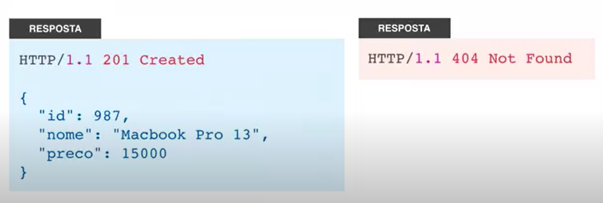

# MODELAGEM DE REST API

## Assuntos abordados:

- Introdução[ok]
- Spring e Injeção de dependencias[ok]
- Introdução JPA e Hibernate[ok]
- REST com spring

# Introdução 

## Projeto a ser Desenvolvido

Sistema de Delivery de Comida, tipo Ifood/Uber Eats, Será um MVP(Produto minimo Viavel) de sistema de comidas;

## Tecnologias

- Maven
- Spring Data JPA (biblioteca que vai ajudar a criar repositorio para usa o jakarta persistence)
- POSTMAN (para testar uma restApi, as requisições)
- Mysql Server
- Flyway (ferramenta para gerenciamento de schema de banco de dados, para manutenção das colunas, tabelas relacionamentos e etc)
- Spring Boot DevTools (restarta a aplicação automaticamente)

- 

## API

- O que é uma API? 

Aplicattion Programming Interface(Interface de programação de aplicação). É um componente de 
Software que possui um conjunto de funções que faz a intermediação de acesso a funcionalidades de algum sistema.

**Para que possa existir uma API é necessário existir dois papeis.**

SOFTWARE CONSUMIDOR <-> API <-> SOFTWARE PROVEDOR.

O software consumidor conversa com o software provedor através de uma API.

## Web Services x APIS(é muito amplo) ,

Web Services são um tipo de API que fornece a sua interface de comunicação pela web.Quando flamos em WebServices estamos
falando de webApi. Uma API não necessariamente precisa servir ao publico externo apenas, mas também ao publico interno.

Todos webservices são APIS, mas nem toda API é webService.

Existem diversas APIS expostas no mundo, dificilmente uma aplicação moderna não consome uma API. 

## Exemplos de API:

Exemplo de uma API do Ifood

SOFTWARE RESTAURANTE <-> API DO IFOOD <-> IFOOD

GRAÇAS A API OS RESTAURANTES PODEM AUTOMATIZAR OS SEUS PEDIDOS

Outro Exemplo - Consumindo webServoices de um provedor:

O agendador de POSts seria um software utilitário para consumir uma API nesse caso o Linkedin

Consumindo Web Services de vários provedores:

Posso ter uma aplicação, onde o cliente chega a uma agencia de viagem, onde o meu software consulta as Apis para verificar quais pacotes são
mais baratos. Uma única aplicação consulta várias APIS e verifica a melhor opção. Lembrando que as Apis utilizada por sua aplicação pode estar consultando
outras APIS.

APIS consumidas por suas User Interfaces e outros sistemas

API consultando outras APIS, um exemplo um aplicativo mobile que consulta a sua própria API, a sua API consulta a melhor opção para o cliente,
podemos ter sites, sistemas internos consumindo a sua API. E podmos também expor a minha API para empresas externas, através de comissão e oytros.

## Exemplos reais de WEB APIS ( Podemos fazer várias integrações com essas APIS)

- Spotify: [https://developer.spotify.com/documentation/web-api/reference/#/operations/get-new-releases]
- Ifood : https://developer.ifood.com.br/pt-BR/
- portal transparecnia do governo: https://portaldatransparencia.gov.br/api-de-dados/cadastrar-email
- Mercado livre: https://developers.mercadolivre.com.br/pt_br/desenvolvimento-seguro (desenvolver um software para ajudar os vendedores/ ou fazer uma integração com ERP para facilitar para os usuarios dessas empresas)
- enotas : https://docs.enotasgw.com.br/docs  (enotas facilita pois expôe sua API e através do enotas pois podemos emitir notas fiscais para diversas prefeituras - paga)
- outras milhares de APIS pagas ou gratuitas 

# Spring e Injeção de Dependências

## O que é Spring REST?

Spring Rest não existe, é apenas um termo para se dizer que temos uma REST API desenvolvida com Spring.

## O que é Spring?

Um ecossistema de projeto, ajuda a desenvolver aplicações com simplicidade e flexibilidade.
O foco do Spring é foco na regra do negócio.Reduzir complexidade do Negócio. Possui maturidade e modularidade.
O Spring está em evolução constante. Spring é openSource e tem uma comunidade forte além de ser muito popular.

Quando falamos em Spring Framework, estamos falando de um projeto que serve como base para todos os outros.

Features
-Spring MVC: usado para Web
-Core tecnologies: base do spring pois está a injeção de dependencia para o Objeto funcionar;
- e muitos outros

Spring Data é um projeto guarda-chuva que agrupa vários outros projetos relacionados a acesso a dados.

- Utilizaremos o Spring Data JPA: ele ajuda a implementar repositórios JPA de forma simples(conhecido como jakarta Persistence),
  Jpa é uma especificação de persistencia de dados para java, ou seja uma tecnologia usada para trabalhar com acesso e com as operações
  relacionadas ao banco de dados relacional usando Java.

Codigo boilerPlate: codigo que precisa escrever várias vezes sendo repetitivos;

Spring Boot: é um projeto que ajuda a criar projetos que se alto configuram, seguindo convenções, não é necessário se preocupar com
a maioria das configurações, eles podem configurar não só os projetos do seu ecossitema, mas também de bibliotecas terceiras.
Spring Boot não gera código, não substitui Spring MVC,Data e outros , ele apenas complementa os outros projetos;

O spring boot incorpora um servlet container, por padrão é o tomcat dentro do jar da aplicação. Dentro do jar ele já tem um container com o tomcat embutido,
ou seja ele já sobe a aplicação

O spring boot apenas ajuda a criar o projeto, não gera código, quando criamos um projeto inicial no springInitializer ela cria uma classe main.

Pensando um pouco no maven que um gerenciador de dependencias, para reduzir a quantidade de linhas de código, utilizamos os startes, que são dependencias 
que agrupam outras dependencias. um exemplo se quisermos trabalhar com jpa podemos incluir o start nas dependencias do POM. 

## Spring boot ou Spring MVC

Spring boot não é um framework só para desenvolvimento WEB, mas você pode usar Spring boot para aplicações que rodam fora da web. 
Spring boot é uma camada de abstração em cima do spring, é uma camada que simplifica ainda mais o desenvolvimento das nossas aplicações, inclusive
spring MVC.

## Spring MVC

Spring MVC é um projeto do ecossistema Spring para desenvolver controladores web que recebem requisições HTTP, e develvem uma 
resposta, podem ser ResrApi ou devolver html ou qualquer outro tipo de arquivo.

O Spring MVC foi adicionado no projeto através do start "web" que incluimos na geração do projeto nas dependencias do maven.

## Spring vs Jakarta EE(Java EE)

Jakarta EE administrado pelo o Eclipse Foundation. A plataforma java EE foi batizada de Jakarta EE. Java EE é baseada em especificações. Um exemplo o JPA é uma especificação que está dentro do jakarta EE,
o JEE é uma especificção guarda chuva que tem várias sub especificações, JPA está dentro do JEE, JPA foi a padronização de algo que já existia, o Hibernate. 
Hibernate após a padronização passou a implemetar a especificação, então o hibernate passou a se tornar o produto a implementação da especificação JPA.

Muitos confundem a diferença entre o Hibernate e o JPA. O Hibernate é de fato o framework ORM, ou seja, a implementação física do que você usará para persistir, remover, atualizar ou buscar dados no SGBD. Por outro lado, o JPA é uma camada que descreve uma interface comum para frameworks ORM.

Hoje o hibernate tem outros concorrentes, se hoje falarmos que estamos usando o JPA não necessariamente estamos o hibernate. 

O Hibernate é um framework para o mapeamento objeto-relacional escrito na linguagem Java, mas também é disponível em .Net com o nome NHibernate.

Com JPA, se houver a necessidade de alterar o sistema de banco de dados, basta trocar o dialeto que um novo e compatível SQL é gerado em tempo de execução. Interessante notar também que o uso do JPA permite que a implementação da especificação seja alterada sem impactos no fonte da aplicação.

## O que é o Java EE?

O Java EE (Java Enterprise Edition) consiste de uma série de especificações bem detalhadas, dando uma receita de como deve ser implementado um software que faz 
cada um desses serviços de infraestrutura.

## O que é Maven

Maven é uma ferramenta de gerenciamento de dependencias e automação de build de projetos java.
Não necessariamente precisa ser com spring.

A estrutura de pastas é padronizada pelo o Maven.

Na raiz do projeto temos os arquivo pom.xml. É onde ficam as configurações de maven no projeto.

pom-> object project model

o arquivo HELP.md é apenas um arquivo que podemos incluir alguma observação do projeto, mas não influencia em nada.

mvnw.cmd e mvnw -> maven wrapper, ele possilita que executemos um maven no terminal, mesmo que não tenha um maven instalado você
não precisa instalar no Sistema operacional. Ou seja ele baixa automaticamente da internet.

Várias IDES já possuem um maven embutido dentro dele.

O maven ajuda a fazer o build do projeto, mas como fazer esse build?
Eu posso clicar em cima do projeto -> Run as -> Maven build, que eu rodo o build do maven. Vai aparecer as configurações.

O package significa que eu quero empacotar, no console roda o maven  e ele gera o pacote, gera o jar dentro da pasta target
dentro do projeto, dentro dele existem várias pastas , o mais importante é o jar.

No terminal eu posso fazer dessa forma também usando o comando:

**escrevi o comando mvn clean package, posso ** ele limpa e gera o jar do nosso projeto. Ou seja ele gera o Build.

Esse arquivo jar é o nosso projeto empacotado, eu posso encaminhar ele por email para que alguém pudesse utilizar o projeto.

**mvn clean - limpa os arquivos anteriores do build

## Class Loader

Class loader ela é responsável por ler a estrutura das classes do nosso projeto e ficar na memória
Ele cria duas class loader, um chamado de base e outro de restart. Tudo que não muda, por exemplo as bibliotecas
ele adiciona no class loader de base, e o que desenvolvemos ele inclui no class loader restart.
Toda vez que alteramos o que desenvolvemos ele reinicia o class loader de restart, e isso torna muito mais rápido o 
desenvolvimento.

## O que é injeção de Dependencias

Injeção de dependência é um padrão de desenvolvimento de programas de computadores utilizado quando é necessário 
manter baixo o nível de acoplamento entre diferentes módulos de um sistema.

Injeção de Dependência é um é um padrão de projeto usado para evitar o alto nível de acoplamento de código.

## Spring IOC Container 

É a implementação de  injeção de dependências do Framework. É algo bem comum em Frameworks que implementam inversão de 
controler/inversão no spring nós temos o Spring Context, ele é reponsável pela injeção de dependencias, como instanciar, de configurar 
injetar Objetos em outros objetos.

No Spring quando rodamos uma aplicação o IOC Container, ele é inicializado e começa a instancializar os Beans que ele deve gerenciar.
Bean(Dependence/dependencia) é nome dado a objetos gerenciados pelo o container do Spring. O Bean é instanciado, ele é configurado e 
pode ser injetado em outros Beans que são gerenciados pelo o Container do spring.

O Container de inversão de Controler do Spring é representado pela interface Aplication Context.

## O que são pontos de Injeção

Pontos de injeção é onde podemos fazer a injeção de objetos dentro dos nossos Beans.

## Anotações

- @Controller : quando eu anoto uma classe com essa inscrição, eu estou dizendo que ela é reponsável por receber requisições web.

## maneira de atualizar a aplicação quando ocorre alteração

Incluir no maven o starter : spring-boot-devtools

## Para fazer desambiguação de Bean

- Usar a anotação @Primary além de componente

- Outra forma de desambiguação : @Qualifier("nome") e também incluir na classe que recebe a injeção
qualifier é um identificador que qualifica o nosso componente.
Formas de descrever o identificador do qualifier: normal, urgente, prioritário mas isso não é padrão é apenas uma maneira.
Um problema quando utilizamos o identificador qualifier é qu ela usa uma string, e uma String não é checada em tempo de
compilação , e sim de execução. Além do que se houver mudança teremos que alterar em todos os locais, pois não será feito 
a alteração automatica, e só saberemos após compilar se está correto

ex:
@Qualifier("urgente")
private  Notificador notificadores;

- Desambiguação de beans com anotação cutomizada , criamos uma anotação customizada.

e utilizamos as anotações:
@Qualifier
@Retention(RetentionPolicy.RUNTIME)//diz quanto tempo deve permanecer onde foi usada, o runtime diz que ela pode ser 
lida em tempo de execução

## Spring Profiles

O Spring Profiles ajuda a segregar as configurações do seu aplicativo e torná-los disponíveis apenas em determinados
ambientes . Um aplicativo executado em muitos ambientes diferentes. Por exemplo, Dev, QA, Test, Stage, Production etc.

é uma forma de separar as aplicações em ambientes diferentes.

O Spring Profiles ajuda a definir facilmente as configurações corretas nos ambientes corretos . Caso contrário, sem ter 
Spring Profiles, é um grande problema gerenciar configurações específicas do ambiente. Por exemplo, sua aplicação pode 
ter que depender das configurações externalizadas nos ambientes. Obviamente, isso é bastante difícil de manter em 
sincronia. Caso contrário, você terá que escrever um monte de componentes semelhantes a fábricas para disponibilizar 
certas coisas com base em determinados parâmetros de parâmetros específicos do ambiente.

Esse profile requer um nome, esse componente notificador vai ser registrado apenas se estiver rodando no ambiente "prod"

@Profile("prod")

Eu tenho que incluir no application.properties ->spring.profiles.active=prod

Eu posso ter vários profiles no application.properties, tenho apenas que separar por vigula e definir os componentes de configuração
com as anotações @Profiles
Ex:spring.profiles.active=prod, mysql, s3, filesystem
Eu posso combinar , e ajuda a deixar a plicação flexível e eseparar ambientes.

## Bean

O @Bean serve para exportar uma classe para o Spring, para que ele consiga carregar essa classe e fazer injeção de
dependência dela em outra classes.

Todos os Beans no spring possuem um ciclo de vida, ou seja as fazes desde existencia desse bean(quando foi injetado) até
quando ele deixa de existir no container

As 3 fazes do ciclo de vida são:

- A fase inicialização;
- Onde vai usar o bean;
- A fase de destruição do Bean;

Podemos implementar métodos de callback para o ciclo de vida, ou seja metodos que declaramos e são chamados pelo o 
próprio container quando passa por alguma fase do ciclo de vida;

@PostConstruct
public void init(){
System.out.println("INIT" + notificadores);
}
//destroy será chamado um pouco antes do bean destuir
@PreDestroy
public void destroy(){
System.out.println("DESTROY");
}

    public void ativar(Cliente cliente) {

        cliente.ativar();
        System.out.printf("Seu cadastro %s  no sistema está ativo \n", cliente.getNome());

    }
}

-> Lembrando que usamos as anotações:     @PostConstruct ,    @PreDestroy, as mesmas não são do Spring e sim do  javax.annotation.

Resultado no console

2022-05-30 10:58:59.833  INFO 8844 --- [  restartedMain] w.s.c.ServletWebServerApplicationContext : Root WebApplicationContext: initialization completed in 955 ms
NotificadorEmail: Real
INITcom.aeviles.deliveryapi.noficacao.NotificadorSms@46f6e363
2022-05-30 10:59:00.129  INFO 8844 --- [  restartedMain] o.s.b.d.a.OptionalLiveReloadServer       : LiveReload server is running on port 35729
2022-05-30 10:59:00.162  INFO 8844 --- [  restartedMain] o.s.b.w.embedded.tomcat.TomcatWebServer  : Tomcat started on port(s): 8080 (http) with context path ''
2022-05-30 10:59:00.170  INFO 8844 --- [  restartedMain] c.a.deliveryapi.DeliveryApiApplication   : Started DeliveryApiApplication in 1.643 seconds (JVM running for 1.989)
/****************Ativando Clientes**************/
Seu cadastro Joao Pedro  no sistema está ativo
Seu cadastro Maria Silva  no sistema está ativo
DESTROY

Outra forma, seria criar uma classe de configuração:

@Configuration
public class ServiceConfig {

    @Bean(initMethod = "init", destroyMethod = "destroy")
    public  AtivacaoClienteService ativacaoClienteService(){
        return new AtivacaoClienteService();
    }
}

onde na anotação @Bean você inclui o init e o destroy

## Mock

Na programação orientada a objeto, objetos mock ou fictícios são objetos simulados que imitam o comportamento de 
objetos reais. Os objetos Mocks são geralmente usados em testes de unidade.

## Observer

um padrão de projeto bastante importante e muito utilizado, o padrão Observer. O padrão Observer é utilizado quando 
se precisa manter os objetos atualizados quando algo importante ocorre.

O Observer é um padrão de projeto de software que define uma dependência um-para-muitos entre objetos de modo que 
quando um objeto muda o estado, todos seus dependentes são notificados e atualizados automaticamente.

O Java também fornece suporte para o padrão de projeto Observer. As API’s mais gerais são a interface Observer e a 
classe Observable no pacote java.util. Elas são bastante semelhantes ao que foi dito aqui, porém possuem bem mais 
recursos que podem ajudar a vida do desenvolvedor em algumas circunstâncias.

Em geral a classe Observable é como o nosso Subject discutido anteriormente, porém Observable é uma classe e não uma 
interface. Alguns dos métodos do Observable são addObserver(), deleteObserver(), notifyObservers(), setChanged(). 
A classe Observable nada mais faz do que monitorar todos os observadores e os notificar sobre alguma alteração no estado.

Um detalhe importante é que antes de Subject chamar o método update() do seus assinates (Observers) deve-se chamar o 
método setChanged() que seta o estado interno do objeto para true, ou seja, chamando o método diz-se que o estado foi
alterado e os Observadores devem ser notificados. Quando este método de Subject é chamado aciona-se o método 
notifyObservers() chamando o método update() de cada Observador passando o objeto e os dados alterados. 
Após as notificações o setChanged() é novamente setado como falso e só chamará o método notifyObservers()
novamente quando for acionado.

De uma forma geral o padrão Observer deixa o acoplamaneto mais baixo entre nossas classes. E o Spring implementa esse 
padrão o qual é chamado de inverter hendler. 

O Spring fornece a classe private ApplicationEventPublisher que permite que publiquemos eventos.

Foi criado um classe que só escuta ->ApplicationEventPublisher. 

@Component
public class AtivacaoClienteService {

    @Autowired
    private ApplicationEventPublisher eventPublisher;

    public void ativar(Cliente cliente) {
        cliente.ativar();

        eventPublisher.publishEvent(new ClienteAtivadoEvent(cliente));
    }
}

## Configurações 

Uma boa prática de programação é não incluir configurações hardCoded dentro do código, um exemplo se irá incluir uma porta, 
um ip de um  banco de dados, um servidor de e-mail, nunca escrever no código java.

E projetos Spring boots, podemos configurar em arquivos de propriedade java os properties files, arquivos yam/yml, em variáveis
de ambiente do SO, também por parâmetros de linha de comando.

No SpringBoot por padrão vem o arquivo application.properties. Nesse arquivo podemos fazer diversas configurações, as que já 
vem do springboot e também podemos criar

Listagem das propriedade que o Spring boot fornece:

- https://docs.spring.io/spring-boot/docs/current/reference/html/application-properties.html

podemos por exemplo mudar a porta a padrão é 8080: server.port=8081 aí teriamos que acessar :http://localhost:8081/hello

## Criando e acessando propriedade customizadas com @Value

e eu crio as variaveis. E associo com através de uma expression do spring${}

## Acessando propriedade com @ConfigurationProperties

Ao invés de incluir configurações com proriedades customizadas, podemos criar uma classe que representa as configurações
de um determinado grupo. E ao invés de injetar valor por valor podemos injetar um objeto dessa classe.

## Persistencia de Dados (capitulo3)

- O que é persistencia de dados?
é um termo usado para dizer que queremos preservar os dados por um tempo, para além da utilização do software.
Ex: quando cadastramos um cliente em um sistema, nós queremos que esses dados sejam persistidos em algum local
de forma que sempre que quizermos consultar uma lista de cliente , esse dado esteja preservado. Nós usamos banco de dados
para fazer a persistencia. No nosso exemplo vamos utilizar o MySql

Nós temos o código java -> temos um driver JDBC -> temos o  BD mySQL

- Driver JDBC: Driver JDBC é um componente de software que intermedia  o acesso de uma aplicação java com o BD, nesse caso
o MySql. Cada Banco de dados tem pelo o menos uma implementação de JDBC. O código java conversa apenas com o JDBC, e 
ele faz a comunicação com o Banco de dados.

Exemplo de uma persistencia sem o uso de JPA:

Exemplo de consulta sem JPA:

- O que é ORM? Object-Relational Mapping , Mapeamento Objeto Relacional é uma técnica para mapeamento de classes que representam
entidades para tabelas de um Banco de Dados relacional. O ORM simplifica a persistencia de dados, de forma a facilitar para 
o programador trabalhe mais com POO e menos no modelo Relacional.

**Mapeamento Objeto-Relacional**

Do lado esquerdo nós temos uma representação Relacional no lado direito temos a representação do modelo Orientado a Objetos

- Persistencia com ORM:

o driver JDBC não fala mais diretamente com o código java, mas sim o o ORM.

Persistencia com ORM - Mapeamento objeto realcional, orm esta usando as mestas informações

Eu faço persistencia através de um objeto. Nesse caso pessoa, e em relacional o Objeto Pessoa é o nome da tabela

Se eu quiser consultar uma pessoa:

- SQL trabalha diretamente contra tabelas de banco de dados relacional, registros e campos, considerando que JPQL 
trabalha com Java classes e instâncias. Por exemplo, a JPQL consulta pode recuperar uma entidade objeto em vez de 
campo resultado definido a partir de um banco de dados, como com o SQL.

## O que é Java Persistence API(JPA)?

Java Persistence API é uma API padrão da linguagem Java que descreve uma interface comum para frameworks de persistência
de dados. A JPA define um meio de mapeamento objeto-relacional para objetos Java simples e comuns, denominados beans de
entidade. JPA é uma especificação JEE, uma solução ORM para persistencia de dados, que é padronizada para desenvolvimento
de aplicações java. JPA define a forma de mapeamento Objeto Relacional possui uma API de consultas e modificaçõess de dados,
e a linguagem de consulta JPQL, na classe java nós utilizamos anotações

- O que é Hibernate? 
Hibernate é uma implementação da especificação JPA, ou seja é o produto que vc coloca no seu produto e usa ele.
- Ou seja JPA descreve como vai funcionar a implementação e Hibernate implementa a solução de acordo coma descrição/implementação.

A JPA, é uma especificação Java para acessar, persistir e gerenciar dados entre objetos Java e um banco de dados 
relacional. O JPA foi definido como parte da especificação EJB 3.0 como um substituto para a especificação EJB 2 CMP 
Entity Beans. A JPA veio da necessidade de simplificar a complexidade do EJB para persistir dados.

A JPA agora é considerada a abordagem padrão da indústria para ORM – Object to Relational Mapping.
Mas independente do framework ORM utilizado, seja o Hibernate, o EclipseLink, o TopLink, o OpenJPA, etc, isso não 
importa, a aplicação será portável para qualquer banco de dados que possua driver JDBC. E não será preciso reescrever 
o código-fonte, pois ele será o mesmo para todos os bancos de dados.

Como funciona a JPA – Ele funciona através de qualquer framework ORM (Mapeamento Objeto Relacional) baseado na especificação JPA.
Pode ser o framework Hibernate, EclipseLink, TopLink, OpenJpa, etc.

Nesse diagrama podemos ver o mundo exterior ao sistema onde os usuários podem acessar a aplicação de qualquer dispositivo,
seja um computador, um tablet, um smartphone ou um notebook, eles vão através da aplicação chamar a camada ORM, onde e
localiza a interface JPA e o framework utilizado seja o Hibernate, o EclipseLink, o TopLink, o OpenJPA, etc. 
E nesse diagrama podemos ver detalhadamente a divisão entre a interface JPA e o framework ORM utilizado.

Agora vou citar alguns objetos da API JPA:

EntityManagerFactory – Interface usada para interagir com a fábrica do gerenciador de entidades para a unidade de persistência.
Quando o aplicativo terminar de usar a fábrica do gerenciador de entidades e/ou no encerramento do aplicativo, o aplicativo 
deve fechar a fábrica do gerenciador de entidades. Depois que um EntityManagerFactory é fechado, todos os seus gerenciadores 
de entidade são considerados no estado fechado.

EntityManager – Interface usada para interagir com o contexto de persistência.
Uma instância de EntityManager está associada a um contexto de persistência. Um contexto de persistência é um conjunto de 
instâncias de entidade em que, para qualquer identidade de entidade persistente, existe uma instância de entidade única. 
Dentro do contexto de persistência, as instâncias de entidade e seu ciclo de vida são gerenciados. A API EntityManager é 
usada para criar e remover instâncias de entidade persistentes, para localizar entidades por sua chave primária e para consultar entidades.
O conjunto de entidades que podem ser gerenciadas por uma determinada instância EntityManager é definido por uma unidade 
de persistência. Uma unidade de persistência define o conjunto de todas as classes relacionadas ou agrupadas pelo aplicativo 
e que devem ser colocadas em seu mapeamento em um único banco de dados.

Agora vou citar algumas anotações da API JPA:
@Entity – Serve para a API JPA saber que a classe anotada com @Entity corresponde a uma tabela da base de dados. 
Uma entidade corresponde a uma tabela.
@Table – É usada em conjunto com a anotação @Entity, serve para a API JPA saber o nome da tabela, em que a classe anotada 
com @Table, tem um atributo “name”, que contém o nome da tabela.

Abaixo segue um exemplo prático da utilização das anotações @Entity e @Table.

Abaixo a ilustração da classe Blog, como podem ver ela possui as anotações @Entity e @Table. E na anotação @Table,
o atributo name, está preenchido com o nome da tabela “blog”.

Abaixo a ilustração da classe Categoria, como podem ver ela possui as anotações @Entity e @Table. E na anotação @Table, 
o atributo “name”, está preenchido com o nome da tabela “categoria”.

## Como fica a Persistencia com banco de dados com JPA

O nosso código java utiliza a API do JPA, ele usa métodos , interfaces e tudo mais, quem implementa essas interfaces é o hibernate
eeé o hibernate que conversa com Driver JDBC.

## Diferença entre JPA E JDBC

JPA é mais rapido no desenvolvimento, e menos trabalhoso. Já que no JDBC você usa SQL nativo para trabalhar diretamente com 
os registros, enquanto que no JPA você trabalha com objetos criados a partir desses registros, concluímos que a performance da 
primeira tecnologia é maior que a da segunda.

## Observações BD

- AI- AUTO INCREMENT: É quando eu quero deixar a responsabilidade para o próprio Banco de Dados incrementar o ID, sem ele 
teremos que incluir manualmente.

Configurando na Entity com a anotação @GeneratedValue(strategy = GeneratedType.IDENTITY), ou seja estratégia de geração de valor
GeneratedType.IDENTITY -> quer dizer que eu estou passando a responsabilidade de gerar o valor de identificador, para o
provedor de persistencia, ou seja o banco de dados. E quando startarmos novamente ele já inclui o autoincremente

Para criar a massa de teste geralmente , criamos um arquivo  padrão chamado 'import.sql'  o qual possui alguns dados para
fazermos nossos testes.

- Existe uma interface em JPA chamada EntityManager , ela é responsável por gerenciar o contexto de persistencia, ele traduz os comandos,
intermedia os comandos pelos SQLS; Com EntityManager conseguimos excluir, consultar, salavar no BD.
-Todas as operações de busca ou de alteração vão nascer com a instância da classe EntityManager.

@PersistenceContext - > aqui ele faz a injeção do EntityManager
private EntityManager manager;

Existe um ciclo de vida das entidades JPA, que é mostrado no diagramaacima. 

Estados de uma entidade:

Uma entidade pode assumir alguns estados com relação ao EntityManager. Os estados podem ser:

- Novo (new ou transient) ->O estado “novo” é o mais natural. É simplesmente quando construímos um objeto qualquer usando o operador new.
- Gerenciado (managed) ->Para estar no estado “gerenciado”, ou seja uma instancia gerenciada pelo o JPA, quando ela está nesse
estado de persistencia ela reflete no BD, podemos chamar os métodos persist, merge ou buscar a entidade usando o EntityManager.
- Removido (removed) ->O estado “removido” é alcançado quando chamamos o método remove.
- Desanexado (detached) ->Por último, uma entidade fica no estado “desanexado” quando é passada para o método detach.
é um estado não gerenciado pelo oJPA.

Para podermos remover uma instancia de cozinha, precisamos transformar o estado de Transient para o managed, senão não será possivel
realizar a remoção.

- Importante notar que entidades desanexadas podem voltar a ser gerenciadas com a chamada do método merge.

Exemplo de uma consulta:

public List<Cozinha> listar(){

TypedQuery<Cozinha> cozinhaTypedQuery=manager.createQuery("from cozinha", Cozinha.class);

    return cozinhaTypedQuery.getResultList();

    }

Para obter o resultado digitado em JPQL, podemos usar o seguinte método deEntityManager

* essa String um JPQL -> linguagem de consulta do JPA, ele consulta em Objetos e não em tabelas
* poderiamos colocar "select from cozinha" ele traria so o nome
* Cozinha.class-> eu quero uma lista de Cozinha

## DDD (Domain-Driven Design (DDD)

Domain-Driven Design (DDD) é um conjunto de princípios para projeto de software, organizados e sistematizados em 2003,
por Eric Evans, em um livro com o mesmo nome.

Os princípios defendidos por DDD têm, no seu conjunto, um objetivo central: permitir o desenvolvimento de sistemas cujo
design é centrado em conceitos próximos e alinhados com um domínio de negócio.

O domínio de um sistema consiste da área e problema de negócio que ele pretende resolver.

## Padrão Agregate do DDD

* Padrão Agregate: é um grupo de objetos de domínio que pode ser tratado como uma unidade

Exemplo: 

- o pacote(agregado) que agrupo Pedido , itemPedido e StatusPedido, sempre que for mexer
num itemPedido temos que mexer no Pedido, existe uma consistencia entre eles.
Podemos dizer que itemPedido é menos forte que Pedido, por isso Pedido é o AgregateRoot.
Um agregado terá apenas um agregateRoot, qualquer referencia de fora do agregado, deve direcionar apenas para o agregateRoot,
devemos evitar ter um relacionamento fora do agregateRoot

O item Pedido está referenciando Produto, NÃO PODERIA referencias FotoProduto.

Usamos esses padrões para deixar a nossa aplicação mais consistente. 

O AgregateRoot garante a integridade de todo o Agregado.

## Padrão Repository do DDD

O Repository é um padrão que adiciona uma camada  de abstração para acesso a dados. Ele imita uma Collection, de forma que 
quem usa o repository, qual mecanismo de persistencia está sendo utilizado pelo o repository
 
Essa interface não tem nenhum detalhe de mecanismo de persistencia. Chamamos esse repositorio de Repositorio Orientado a
persistencia.

## Código BoilerPlate

Em programação de computadores, código boilerplate se refere a seções de código que devem ser incluídas 
em muitos lugares com pouca ou nenhuma alteração.

Para podermos esconder usamos o lombok. Para que o código fique mais limpo.

## Mapeamento relacionamento com @ManyToOne(muitos para um)

Mapeamento relacionamento com @ManyToOne :Neste relacionamento, cada linha de uma entidade é referenciada a muitos 
registros filho em outra entidade. O importante é que os registros de filhos não podem ter vários pais.

    //anotação de muitos para um(muitos restaurantes possuem uma cozinha)
    @ManyToOne
    private Cozinha cozinha;

CREATE TABLE `restaurante` (
`id` bigint NOT NULL AUTO_INCREMENT,
`nome` varchar(255) DEFAULT NULL,
`taxa_frete` decimal(19,2) DEFAULT NULL,
`cozinha_id` bigint DEFAULT NULL,
PRIMARY KEY (`id`),
KEY `FK76grk4roudh659skcgbnanthi` (`cozinha_id`),
CONSTRAINT `FK76grk4roudh659skcgbnanthi` FOREIGN KEY (`cozinha_id`) REFERENCES `cozinha` (`id`)
) ENGINE=InnoDB DEFAULT CHARSET=utf8mb4 COLLATE=utf8mb4_0900_ai_ci

CREATE TABLE `restaurante` (
`id` bigint NOT NULL AUTO_INCREMENT,
`nome` varchar(255) DEFAULT NULL,
`taxa_frete` decimal(19,2) DEFAULT NULL,
`cozinha_id` bigint DEFAULT NULL,
PRIMARY KEY (`id`),
KEY `FK76grk4roudh659skcgbnanthi` (`cozinha_id`),
CONSTRAINT `FK76grk4roudh659skcgbnanthi` FOREIGN KEY (`cozinha_id`) REFERENCES `cozinha` (`id`)
) ENGINE=InnoDB AUTO_INCREMENT=4 DEFAULT CHARSET=utf8mb4 COLLATE=utf8mb4_0900_ai_ci

O motor InnoDB é o mais utilizado como padrão de engenharia da tabela 

- isso só precisa ser feito se criar as entidades(tabelas) através das entidades , senão esta gerando as tabelas atarves
das entidades não é necessário incluir essas anotações de nullable 

Se você estiver trabalhando com banco de dados legado ou queira alterar o nome da coluna é necessário incluir a anotação
@JoinColumn(name="cozinha_id")

    @ManyToOne
    @JoinColumn(name = "cozinha_id") //pra alterar o nome da coluna
    private Cozinha cozinha;

Para especificar que não aceita nulo é necessário incluir dentro da anotação @Colunn(nullable=false)

    @Column(name = "taxa_frete", nullable = false)
    private BigDecimal taxaFrete;

## O que é REST

REST:acrônimo REpresentational State Transfer, é um estilo arquitetural para desenvolver WEB API'S, ou seja para desenvolver
WEB SERVICES,
REST é uma especificação que define a forma de comunicação entre componentes de software na web, independente da linguagem 
de programação usada.

REST surgiu nos anos 2000, a partir da tese de PHD de um cientista chamado Roy Fielding, seu intuito era formalizar um 
conjunto de melhores práticas
para desenvolvimento de webServices, essas melhores práticas são chamadas de constraints(regras) que devem ser seguidas 
para uma API ficar em conformidade com
REST, então uma RESTAPI é uma API que segue as regras especificadas por Roy Thomas Fielding.

Rest é um estilo arquitetural utiliado para desenvolver REST APIS/ WEB Services, ele foi desenvolvido para usar protocolos 
que já existem, como o HTTP.

Essa comunicação é feita utilizando a aespecificação REST

Para que uma aplicação possa consumir uma REST API ela precisa conhecer apenas o protocolo HTTP não precisa instalar nada.
E essa facilidade de integração
entre os sistemas, fez com que REST se torna-se a forma mais popular para desenvolver webServices. As APIS mostradas acima 
utilizam a arquitetura REST.

## Por que usar REST?

- Separação entre cliente(quem consome a api) e servidor(quem provê a API), dessa forma nós temos uma maior flexibilidade 
e portabilidade.
- Escalabilidade, se um servidor não está sendo sufiente , podemos incluir outros;
- Independência de linguagem;
- As APIS podem interagir entre si, além de serem consumidas ´por outras aplicações;
- demanda alta de mercado
- REST ajuda muito a fazer integrações

## Constraints (melhores práticas)

- Cliente-servidor:( nós precisamos de um cliente que pode ser uma aplicação front-end, mobille, uma outra API enviando 
requisições para um servidor, as aplicações cliente servidor podem evoluir sem inteferir no outro, inclusive um 
cliente x servidor pode ser substituído sem interferir em nada, desde que a interface entre eles seja inalterada.

- Stateless: significa sem estado, a aplicação não deve ter estado, Roy Fielding se inspirou no protocolo http para essa 
constraint, na prática quer dizer que essa requisição feita ao servidor da API , deve conter tudo para que seja devidamente
processada. O servidor não pode manter uma seção.

- Cache: , a API pode fazer cache das requisições, cache é uma memória de consulta rápida, ela melhora a escalabilidade 
do servidor, pois reduzimos o numeros de hits no servidor, ou seja numero de acesso. (possibilidade de incluir quando necessário)

- Interface Uniforme (desacopla a arquitetura) para ficar de acordo com essa constraint devemos identificar os recursos 
do sistema usando URI's seguindo um padrão. Devemos usar o padrão do protocolo de comunicação para interagir com a API, 
geralmente usamos o verbo do protocolo http( put, get, delete, post...). A resposta de uma requisição deve ser padronizada,
incluindo informações de como o cliente deve tratá-la;

- Sistema em camadas, a possibilidade entre o cliente que consome e o servidor que hospeda a API ter outros servidores no meio do caminho,
  esses servidores podem oferecer uma camada de segurança, de cache, balanceamento de carga, o cliente não deve conhecer quantas camadas possuem no meio

- Código sobe demanda(opcional) o servidor pode enviar como resposta de um código que deve ser utilizado no cliente. (Pouco usada)

## REST X RESTFUL

A diferença entre os termos são conceituais, REST é o estilo arquitetural que possui as constraints ou seja é a especificação,
RESTful API é uma API desenvolvida em conformidade com as constraints, ou seja uma REST API segue todas as contraints obrigatórias.

## PROTOCOLO HTTP

O modelo arquitetural REST independe de linguagem e tecnologia, REST não restringe o uso de um protocolo em particular, apesar do modelo ser independente
de protocolo, para colocar REST m prática é necessário o uso de um, e o mais usado é o protocolo http.

COMO FUNCIONA O PROTOCOLO HTTP: REQUISIÇÃO X RESPOSTA

CLIENTE <=> |REQUISIÇÃO X RESPOSTA |<=> SERVIDOR

COMPOSIÇÃO DA REQUISIÇÃO

Para formar uma requisição precisamos de um método/URI/versão do protocolo http/cabeçalhos e corpo.
As vezes chamamos os métodos de verbos http

Método -> indica a ação que queremos que seja executado; (GET, POST, PUT, DELETE)

- get: o metodo get solicita que seja devolvido nas repostas os dados que precisamos
- post: o metodo post submete dados para o servidor, usamos muito para adicionar dados no BANCO DE DADOS

**Composição de Requisição**

URI-> caminho que identifica o que queremos dentro do servidor http. POST /produtos em palavras cadastrando produtos

Apesar de existir a versão 2.0 do http a mais comum ainda é a 1.1 .

Os cabeçalhos são informações sobre a requisição. Eles definem nomes de chaves e valores, que podem ser usados pelo o servidor
para interpretar a requisição e executar a operação. Temos vários cabeçalhos pré-definidos no protocolo HTTP, mas podemos 
criar os nossos próprios cabeçalhos customizados também. 
No cabeçalho acima nós temos o Content-Type, que define qual tipo de conteúdo está sendo enviada no corpo da requisição.
Estamos dizendo que a requisição está indo com um corpo no formato json(um formato de transporte de dados), o cabeçalho content-Type 
é muito importante para o servidor saber  como interpretar a mensagem no corpo corretamente.
Temos o Accept: que define quais tipos de conteúdo são aceitos como uma resposta, nesse exemplo estamos especificando um, que
é o json, isso quer dizer que o servidor obrigatoriamente deve retornar uma resposta nesse formato especificado.
Se o servidor não puder devolver uma resposta neste formato é melhor que ele retorne um erro.

Em relação ao corpo de uma requisição ele não é obrigatório, depende do método http utilizado.
Basicamente é no corpo da requisição que enviamos os dados do cliente para o servidor.

Nesse exemplo estamos enviando um produto.

**Composição da resposta**

Uma versão também possui componentes importantes, como a versão do protocolo http, status, cabeçalho e corpo.

O status serve para descrever o status do processamento da requisição.
O servidor deve retornar um status adequado para cada situação. Para que possamos saber o que aconteceu.
Exemplo: se o servidor realizou com sucesso, se houve algum erro, etc...
O Status 201 - é retornado na resposta, esse status significa que o recurso foi criado com sucesso.
Ou seja o recurso foi cadastrado com sucesso

Nesse exemplo a resposta informa que o conteúdo está no formato json. 

E o corpo da resposta é onde fica o conteúdo da resposta. Pode ter um corpo ou não.

Corpo/Payload, não é obrigatório, e é nesse corpo que enviamos oa dados para API

composição da resposta.

## Usando o protocolo http

-> aplicativo que se conecta com o servidor : telnet
Vou digitar no cmd-> telnet www.uol.com.br 80
a porta padrão do http é a 80

GET / HTTP/ 1.1
Host: www.uol.com.br
Accept: text/html

-> client gnutls
(GnuTLS é uma biblioteca de comunicações seguras que implementa os protocolos e tecnologias SSL, TLS e DTLS em torno deles.
Ele fornece uma interface de programação de aplicativos (API) em linguagem C simples para acessar os protocolos de comunicação 
seguros, bem como APIs para analisar e gravar X.509, PKCS #12 e outras estruturas necessárias.)

Podemos Clientes aos invês de usar esses servidores

Eu posso utilizar o POSTMAN e não fazer manualmente .

## POSTMAN

Utilizamos o POSTMAN para organizar e testar as requisições da REST API.

Uma das funcionalidades do POSTMAN é ser um client de uma RST API.

eXEMPLOS DE OUTRAS FERRAMENTAS SEMELHANTES O postam: insomnia

## RECURSOS REST

Um recurso é qualquer coisa exposta na web, é algo que tem importancia para ser refenciado no software. Exemplo: documento, pagina, video, foto,
até mesmo um processo de negócio, em um ecommerce um produto pode ser considerado um recurso.

Singleton Resource.Um recurso é uma instancia de uma determinada classe. Um recurso que significa uma unica coisa é chamado de singleton Resource.
Os recusos podem ser agrupados em coleções(collection Resource)Coleção de Produtos é um recurso.

## IDENTIFICANDO RECURSOS

REST usa URI para identificar os Recursos, URI é uniforme Resource Identifier, identificador de recurso uniforme, nada mais é que um conjunto
de caracteres  que tem como objetivo dar um endereço para os recursos de forma não ambigua.

Quando modelamos um recurso temos que pensar em um tipo de URI's para identifica-los.

URI X URL: URL é um tipo de URI.
URL: significa Uniforme resource Located (localizador de Recurso uniforme), é um tipo identificação de recurso também, mas 
ela não identifica apenas o identificador mas também a localização do recurso. Onde o recurso está disponivel, e como faz
para chegar até ele.

Quando vemos urls como https://algumacoisa/cliente  -> nós estamos identificando um recurso e tambémcomo chegar até ele que 
é através do protocolo http.

Quando for falado de uri e url estamos falando da mesma coisa -> identificação de um recurso

Ex: /listasProdutos

url Completa: httpd://api.aligumacoisa.com.br/listasProdutos

Não é uma boa pratica identificar uma URI dessa forma

o corretos é : /produtos
sem identificar ação

RECURSO UNICO
/produto/{codigo}

url Completa: https://api.qualquercoisa.com.br/produto/331  ->errado: está no singular
url Completa: https://api.qualquercoisa.com.br/produtos/331  ->certo: está no plural

temos que usar o recurso sempre no plural, pois facilita o consumidor da API e quem desenvovle
A uri deve ser um substantivo certo: /produtos   errado: /listasProdutos

localhost é o endereço local da minha máquina localhost= 127.0.0.1

## Controladores (controller)

Controlador é uma classe responsável por receber requisições web, tratar essas requisições e devolver uma resposta

import java.util.List;
@ResponseBody //indica que a resposta do metodo listar deve ser enviada como resposta da requisição http
@Controller   //Classe Controller
@RestController //essa anotação é um controlador e possui @Response body
@RequestMapping("/cozinhas")//todas as requisições /cozinhas vai cair nessa requisição

se eu usar @RequestController não é necessário usar a requisição ResponseBody , pois a responseController já possui
esse método.

localhost:8080/cozinhas  -> uma coleção de recurso

json: é uma  notação de transferencia de dados, ela é muito leve

O que é JSON?
Resultado de imagem para o que é json
JSON é basicamente um formato leve de troca de informações/dados entre sistemas.É  uma formatação utilizada para 
estruturar dados em formato de texto, e transmiti-los de um sistema para outro, como em aplicações cliente-servidor ou
em aplicativos móveis  Mas JSON significa JavaScript Object Notation, ou seja, só posso usar com JavaScript correto?
Na verdade não e alguns ainda caem nesta armadilha. O JSON além de ser um formato leve para troca de dados 
é também muito simples de ler.

A chave que abre e fecha significa um objeto {} ,
dentro de objeto eu tenho propriedade que são definidas por chave e valor:
"id"=chave
1=valor

separados por virgula

O colchete significa que tenho uma lista []

[
{
"id": 1,
"nome": "Tailandesa"
},
{
"id": 2,
"nome": "Indiana"
},
{
"id": 3,
"nome": "Japonesa"
}
]

## Representações de Recursos e Content Negotiation

Recurso é qualquer coisa exposta na web como um documento, video ou produto ou qualquer outra entidade do sistema.
Um recurso para ser alcançado precisa ser identificado por uma URI, precisamente precisamos de uma url para requisitar
utilizando o protocolo HTTP. 

Mas o que uma requisição feita em uma url de um recurso deve retornar? aí entra outro conceito importante:
Representações de recursos

O que é Representação de Recurso? é um código que descreve o estado atual do recurso

Essa imagem acima poderia ser a representação retornada no corpo de uma requisição feita para /produtos.
Ou seja, o recurso identificado como /produtos é uma coleção e por isso a representação dessa coleção é uma listagem dos 
produtos encontrados em um formato específico. Essa representação acima , está no formato json, que é a mais usada em REST API.

Conceitualmente a  representação de um recurso(o que você está vendo acima,) não é o recurso , o recurso é o objeto, 
A representação é a transformação desse objeto em um código, que seja possivel visualizar /ler informações do recursos.

Podermos ter vários tipos de representação para um recurso, ou seja um recurso pode ser visualizado de diferentes formas.
Quando o cliente da API faz uma requisição, ele pode especificar qual o formato consegue interpretar, ou seja consegue
visualizar o formato que ele pode aceitar.

Essa requisição é adicionada no cabeçalho da requisição, com o nome Accept, o valor desse cabeçalho é um mídia type, ou seja
é um tipo de mídia. Existem vários tipos de mídiatypes padronizados. O visualizado acima  é um application/json, e nesse 
caso ele só aceita o formato json. é claro que cabe ao servidor aceitar ou não a requisição do cliente, se o cliente
solicitar a requisição em formato json, e o servidor não tiver suporte a isso ele pode sisplesmente negar e retornar um erro.

Outro formato muito utilizado é o xml.

O consumidor da API pode especificar um mídiatype aplicattion/xml no cabeçalho da requisição http, se o servidor suportar 
esse midiaType uma resposta com a representação do recurso no formato xml é devolvida. 

Essa indicação de qual formato de representação de um mesmo recurso deve ser retornado é o que chamamos de Content Negotiation
ou em portugês negociação de conteúdo.
Por que o consumidor de certa forma está negociando com o servidor ele diz o que quer e o servidor pode aceitar ou não.

Qual formato de representação devemos usar?

é necessário analisador os consumidores de Api, geralmente se usa o json, mas pode ser utilizado outras formas

## Negociando o media type do payload do POST com Content-Type

Nós podemos negociar não só o produto que recebemos, mas também o que enviamos.

O Accept é o que agente manda para o servidor dizendo para ele o que eu aceito como resposta.

O Content-type é o que eu estou te enviando, qual formato estou enviando.

## Consultando uma coleção - Collection Resource

localhost:8080/cozinhas

O colchete significa que tenho uma lista []
Com 4 objetos

[
{
"id": 1,
"name": "Acre"
},
{
"id": 2,
"name": "Alagoas"
},
{
"id": 3,
"name": "Amapá"
},
{
"id": 4,
"name": "Amazonas"
}
]

## Consultando Singleton Resource com Get e @PathVariable

Quando eu quero uma cozinha especifica.

  /{cozinhaId}")->Path variable "cozinhaId" pode ter qualquer outro nome

(@PathVariable("cozinhaId") Long id)->na anotação @PathVariable passamos o nome da nossa variavel que queremos fazer um biding

Posso descrever o método findById no controller dessa forma:

        @GetMapping(value = "/{cozinhaId}")
        public Cozinha findId(@PathVariable("cozinhaId") Long id){ 
                return cozinhaRepository.findById(id);
        }

E também dessa forma:

        @GetMapping(value = "/{cozinhaId}")
        public Cozinha findId(@PathVariable Long cozinhaId){ 
                return cozinhaRepository.findById(cozinhaId);
        }
dessa forma ele faz o biding automaticamente, quando incluímos o nome do path no parametro

localhost:8080/cozinhas/1 ->  /cozinhas//{cozinhaId}

- Estou retornando apenas uma cozinha, então abre e fecha chaves é 1 unico objeto json
{
"id": 1,
"nome": "Tailandesa"
}

## Customizando as representações XML e JSON com @JsonIgnore, @JsonProperty e @JsonRootName

Qualquer classe que esteja dentro do pacote domain-model representa um modelo de domínio, ou seja é uma classe de negócios
que representa as entidades da nossa aplicação.

Jackson é uma biblioteca que usamos para fazer serialização e desserialização, para gerar as representações dos recursos
de acordo com o formato que quisermos.

Exemplo de representação:

    @JsonProperty(value = "titulo")
    @Column( nullable = false)
    private String nome;

ao invés desse que utiliza o nome do atributo:

Com a utilização da anotação  @JsonProperty(value = "titulo")

Quando não queremos  devolver/aparecer na apresentação desse recurso. a propriedade é @JsonIgnore, ela ignora a propriedade quando
for serializar/gerar a representação

    @JsonIgnore
    @Column( nullable = false)
    private String nome;

@JsonRootName("gastronomia") -> customiza os nomes, só funciona no xml

- Customizar o formato xml

## Flyway

O Flyway é um framework que permite o versionamento e gerenciamento do Banco de dados, com ele podemos controlar a
evolução dos elementos que compõem uma determinada base de dados, sendo eles Tabelas, Sequences, Views, entre outros.

Podemos utilizar o Flyway para manipular diferentes sistemas de Banco de dados relacionais, isso é possível porque ele é
desenvolvido baseado na API JDBC onde basta especificar o Driver do banco e realizar as migrações.

O Flyway pode ser utilizado através de linha de comando, ou utilizando ferramentas como Maven, Gradle, Ant, SBT,
entre outras.

Criando os Scripts

Os scripts são criados utilizando a linguagem SQL ou através de uma API Java, neste exemplo utilizaremos SQL, o Flyway
segue uma convenção para o nome dos Scripts, que é V{numero da versão}__<nome_do_script>.sql, estes scripts devem ser
adicionados dentro do diretório sql(são dois underscore após o numero da versão).

## Metodos http /Verbos http

Métodos http também conhecido como verbos http.Toda requisição é obrigatorio ter um método HTTP.E um método possui a 
semantica da operação a ser efetuada sobre determinado recurso.  Através dos métodos http nós dizemos para o servidor qual o
tipo de serviço nós devemos executar em um determinado recurso indentificado pela URI. Pode ser recuperar dados, cadastrar,
excluir, modificar e etc...

Método GET : é usado quando existe a necessidade de obter a representação  de um recurso. O GET não gera efeito
colateral, não tem alteração no estado sa aplicação. O GET não é usado para mudar um recurso, por isso ele 
é chamado idempotente.

Idempotente/idempotencia: significa que requisições repetidas na sequencia não geram efeito colateral; ou seja tem a capacidade de poder
ser aplicada mais de uma vez, sem que o resultado da primeira vez seja alterado.

## Principais métodos HTTP

- GET : Esse método é usado quando existe a necessidade de obter a representação de um recurso, seja um singleton resource ou 
uma collection resource.

Se executarmos esse mesmo get várias vezes no mesmo recurso o resultado será o mesmo da requisição inicial, porque não gera
efeito colateral. O GET não pode ser utilizado para mudar o recurso, por isso o GET é um método seguro. Quando um método não gera efeito 
colateral nem altera um recurso ele é um método seguro, em ingês "safe metod", e também é um método idempotente.

- POST : O método POST é utilizado para criar um novo recurso, dentro de uma coleção de recursos. Por exemplo para criar 
uma nova cozinha, nós podemos fazer uma requisição com POST em /cozinhas, diferente do método GET, no POST nós enviamos um corpo
na requisição com um payload, ou seja os dados que nós queremos submeter para o servidor criar um novo recurso. 
Se fizermos essa mesma requisição POST no mesmo recurso nós teremos um efeito colateral. Vários recursos serão criados.
Por isso POST não é idempotente e nem seguro(lembrando que um método seguro é aquele que não modifica recursos)

- PUT : método PUT é usado geralmente como forma para atualizar determinado recurso. Para atualizar os dados de uma cozinha
por exemplo nós fazemos um PUT com cozinhas seguido pelo o codigo->  /cozinhas/11 . E enviamos no corpo da requisição os
dados que precisam ser atualizados. Note que o PUT deve atualizar não só os dados informados no corpo da requisição, ele
deve atualizar o recurso completo, não pode ser utilizado para uma atualização parcial. Por exemplo se um recurso tem dois
atributos, e foi passado apenas um atributo para atualizar, temos que atualizar o recurso completo, então o atributo que
não foi pasado será considerado como vazio ou nulo na atualização. Conceitualmente PUT pod ser utilizado também para 
criar novos recursos, não é muito utilizado. No exemplo abaixo, ele irá atualizar e não criar id. O PUT é considerado um
método não seguro, porque modifica os dados do recurso e também ele é considerado idempotente, ele é idempotente porque
mesmo que você execute várias vezes o PUT em um mesmo recurso o resultado é sempre o mesmo da requisição inical,

- PATCH : outro método menos utilizado é o PATCH ele serve para atualizar um recurso parcialmente, por exemplo imagine que temos um 
recurso na uri /produtos/3  e esse recurso tem vários atributos, mas nós queremos atualizar só o preço, podemos fazer um PATCH
nessa URI e no corpo da requisição passar só o novo preço, dessa forma os produtos permanecem inalteraveis e modificamos
apenas o que foi informado, nesse caso o preço.

A implementação do metodo PATCH  é mais complexa do que fazer um PUT, porque temos que tratar os atributos  de forma isolada,
validar so que foram informados, ignorar os demais.

Patch não é um método seguro e é idempotente.

- DELETE: O método delete tem como finalidade a remoção de um determinado recurso. Não passamos nem recebemos um corpo na
requisição. Ele é um método não seguro e idempotente(isso é questionável), mas devemos pensar no efeito colateral do estado da aplicação.
Se executarmos a exclusão duas vezes de um mesmo recurso, a primeira chamada vai realmente excluir, a segunda chamada não vai excluir,
mas não altera em nada o estado da aplicação, por isso consideramos idempotente, ou seja o estado da aplicação continua o mesmo 
a partir da segunda requisição.

- HEAD : o método HEAD é igual ao GET com uma exceção, ele nunca retorna um corpo na resposta, ele é usado apenas para
buscar um cabeçalho. As vezes o consumidor da API, não está interessado no corpo da resposta. Por exemplo para testar:
se uma URI existe mesmo, se um midiaType é aceito e etc.

- OPTIONS : o metodo OPTIONS não tem nenhuma relação com criar, alterar, modificar ou excluir recursos. O OPTION é utilizado
para solicitar uma lista de métodos suportados por um recurso. Nós não implementamos todos os métodos em um mesmo recurso, por
o OPTIONS é util para o cliente consultar quais são os métodos disponíveis.

## Códigos de Status HTTP

Uma REST API é desenvolvida para ser usada pelos consumidores.Por isso quando estamos modelando uma API nós temos que pensar
sempre na experiencia de uso do consumidor da API. É importante que sejam criadas APIS fáceis de serem consumidas, onde o
desenvolvedor possa usá-la sabendo exatamente o que esperar.

Uma das coisas que devemos pensar para deixar a API padronizada é o codigo de Status HTTP que você deve retornar para
uma requisição. Desenvolvedores e consumidores de API devem conhecer os Status HTTP de forma que ninguém tenha que aprender 
isso novamente para cada API que vai desenvolver ou que vai consumir.

-Relembrando:

Uma resposta obrigatoriamente possui um status HTTP, cada código significa uma coisa, ou seja um tipo de resultado da requisição
feita, por exemplo se uma requisição foi bem sucedida a API deve retornar um código, senão foi bem sucedida deve retornar um
outro código. Existe uma lista padronizada de protocolos HTTP : iana.org -> https://www.iana.org/assignments/http-status-codes/http-status-codes.xhtml#http-status-codes-1

Os códigos de Status HTTP são agrupados em níveis: 

* Nível 200(qualquer código de status entre 200 a 299) :esse nível indica que a requisição foi bem sucedida.
Não houve nenhum problema na execução. Dentro desse nível especifico existe códigos que especificam alguma coisas.
Mas todos significam Sucesso.

- 200 - ok :padrão para requisições executadas com sucesso
- 201 - created  :significa que a requisição foi atendida e foi criado um novo recurso com sucesso. Isso é muito utilizado
para quando fazemos a inclusão de um novo recurso e essa inclusão é feita com sucesso, aí a resposta vem com o código 201.
- 204 - no content(sem conteudo): sigifica que o servidor  processou a requisição com sucesso, e não está retornando nenhum 
conteúdo no corpo da resposta, é muito usado por exemplo quando pedimos a exclusão de um recurso e isso é feito com sucesso.
O servidor não retorna a representação do recurso nesse caso. Por isso só informar o status 204 é suficiente para saber
que a exclusão foi feita.

* Nível 300(qualquer código de status entre 300 a 399) :esse nível indica status de redirecionamento
 
- 301 :Moved Permanently(movido permanentemente) , o código 301 diz que a requisição e todas as futuras evem ser redirecionadas para
um endereço fornecido no cabeçalho da resposta, ou seja um redirect permanente. Quando esse status é retornado um cabeçalho 
com o nome location deve existir na resposta informando a URI para onde o recurso foi movido.
- 302:Found(Encontrado), esse código 302 significa  que o endereço do recurso existe, mas foi alterado temporariamente.
É necessário adicionar um cabeçalho location também quando usar o código 302. Como um redirecionamente pode ser alterado no futuro
já que ele é temporário, o consumidor da API não deve entender essa mudança como definitiva , por isso ele pode continuar 
usando a URI original para requisições futuras.

* Nível 400(qualquer código de status entre 400 a 499) :esse nível indica algum erro por parte do consumidor da API, ou seja
em quem criou a requisição, quando o servidor recebe uma requisição ele tem a chance antes de executar o que foi solicitado
e de verificar se todas as informações da requisição estão corretas, coerentes e se o cliente realmente tem permissão de solicitar 
o que está pedindo. Caso tenha algo errado o servidor responde com o Status de Nível 400.

- 400 - Bad Request( Requisição mal feita): o código 400 significa que o servidor não pode processar a requisição porque ele não conseguiu
entender a mensagem, ou por que ele percebeu outro erro por parte do cliente, pode ser algum erro de sintaxe, ou erro de
validação.
- 401 - Unauthorized(não autorizado): o código 401 indica que a requisição não será executada por que requer que o cliente seja 
autenticado.
- 403 - Forbidden(Proibido): o código 403 indica que o servidor entendeu a requisição, mas se recusou a executá-la porque o cliente 
não está autorizado.
- 404 - Not Found(Não encontrado): o código 404 significa que o recurso não existe.
- 405 - Method Not Allowed(Método não permitido) : o código 404 significa que o verbo http usado na requisição não é suportado
pelo o recurso,. Por exemplo se a requisição usou um verbo DELETE mas o recurso não pode ser excluido, esse status 405 é retornado
- 406 - Not Acceptable(não aceito):o código 406 diz que o servidor não pode retornar a representção  do recurso usando mídiaType informada no
cabeçalho accept da requisição.  Se o mídiaType não é suportado pelo o servidor , esse é o código de status que receberemos.
Um exemplo se incluirmos application/xml , mas o servidor só suporta application/json, esse é o código que ele deve retornar

* Nível 500(qualquer código de status entre 500 a 599) :esse nível 500 indica erro no servidor. Esse é o tipo de erro que 
não queremos que aconteça por que provavelemente a responsabilidade é nossa em corrigir o erro. Geralmente indica algum 
problema no nosso código ou com servidores.

- 500 - Internal Server Error(Erro interno no servidor que ele não sabe tratar): é muito comum esse erro acontecer quando
o desenvolvedor  erra no tratamento de exceptions. por exemplo se você deixar uma NullPointerException ser lançada o status 
correto para retornar o cliente é 500
- 503 Service Unavailable(serviço indisponivel):indica que o servidor não pode responder requisições por que ele está em manutenção
ou está sobrecarregado.

É muito importante usar os códigos de Status de maneira CORRETA.

Quantos códigos de status HTTP uma API deve usar? contando com os status que o próprio framework já retorna sem precisarmos
implementar em nosso código, eu diria que a API geralmente vai usar entre 10 e 20 códigos. Mas não existe uma quantidade certa.

Por padrão quando fazemos uma requisição e ela é executada com sucesso o spring retorna para nós o status http 200. 
Isso significa ok -bem sucedido. E esse é um padrão de resposta do Spring, e nós podemos alterá-los.

Nós apenas utilizamos a anotação @ResponseStatus em cima do método que queremos alterar O CÓDIGO HTTP .
Exemplo:

@ResponseStatus(HttpStatus.OK)  <-
@GetMapping(value = "/{cozinhaId}")
public Cozinha findId(@PathVariable("cozinhaId") Long id){
                return cozinhaRepository.findById(id);
}

## ResponseEntity

- Antes : Cozinha está sendo usada como modelo de representação do recurso, ou seja retornando um objeto do tipo Cozinha
o Jackson que faz a transformação do objeto em json, xml ou outros... ele vai transformar o objeto java em json, ou seja
vai serializar ele em json ou xml dependendo do formato que especificarmos no headerAccept. Vimos que podemos alterar o status
http usando a anotação @ResponseStatus(HttpStatus.OK), mas também podemos ter um controle maior da resposta HTTP, por exemplo
adicionar novos headers e inclusive mudar o status http de uma forma mais programática. Como veremos com o uso de ResponseEntity

       @ResponseStatus(HttpStatus.OK)  
        @GetMapping(value = "/{cozinhaId}")//Path variable "cozinhaId" pode ter qualquer outro nome
        public Cozinha findId(@PathVariable("cozinhaId") Long id){ //PathVariable passamos o nome da nossa variavel que queremos fazer um biding

                //um print para verificar o erro
                System.out.println("TIPO DE VARIAVEL"+id);
                return cozinhaRepository.findById(id);
        }

- Apos a inclusão de ResponseEntity:  Ao invés de retornarmos uma instancia de Cozinha como mostrado acima, vamos retornar 
uma instancia de ResponseEntity, ele representa uma resposta HTTP onde pode ter inclusive uma instancia de Cozinha no respnseEntity.
ResponseEntity<T> = ResponseEntity<Cozinha> ou seja tipamos ele.

ResponseEntity: Usando Spring ResponseEntity para manipular a resposta HTTP. ResponseEntity representa toda a resposta 
HTTP: código de status, cabeçalhos e corpo . Como resultado, podemos usá-lo para configurar totalmente a resposta HTTP.
Se quisermos usá-lo, temos que devolvê-lo do endpoint; O spring cuida do resto.ResponseEntity é um tipo genérico. 
Consequentemente, podemos usar qualquer tipo como o corpo da resposta:

Ex:
@GetMapping("/hello")
ResponseEntity<String> hello() {
return new ResponseEntity<>("Hello World!", HttpStatus.OK);
}

Response Entity permite que possamos customizar a resposta HTTP.

        @GetMapping(value = "/{cozinhaId}")// Biding Path variable "cozinhaId" pode ter qualquer outro nome
        public ResponseEntity<Cozinha> findById(@PathVariable("cozinhaId") Long cozinhaId){ //PathVariable passamos o nome da nossa variavel que queremos fazer um biding

                Cozinha cozinha=cozinhaRepository.findById(cozinhaId);

                //um print para verificar o erro
                System.out.println("TIPO DE VARIAVEL"+cozinhaId);
                return ResponseEntity.status(HttpStatus.OK).body(cozinha); //se eu não coloco o body ele não me retorna um payload na volta, ou seja um corpo

                //se eu não quiser um corpo
               // return ResponseEntity.status(HttpStatus.OK).build(); //build constroi um response entity

        }

* Sem o corpo 

* Com o corpo

- Outras possibilidades- conseguimos customizar não só o status, mas também o header da resposta

OBS: Quando por exemplo tivermos uma collection resources localhost:8080/cozinhas, quando fazemos uma requisição
e eu não tenho cozinhas no meu banco , e recebo um array vazio (uma lista vazia)->[], e retorna um ststus HTTP 200, 
sendo que a lista está vazia. A boa prática não é retornar 404. Um outro mal uso é usar o código 204 -no content,
pois 204 quer dizer vazio mesmo, e no nosso caso não está vazio, nós temos uma lista que não tem nada dentro dela.
O correto é deixar o status 200.

## Modelando e implementando a inclusão de recursos POST

Para incluir um recurso utilizamos - Modelagem abaixo:

POST /cozinhas  HTTP/1.1
Content-Type: application/json ( estou informando ao servidor que estou passando um corpo/payload dessa requisição no formato json)
{
"nome": "Brasileira",
"descricao": "A tradiciona cozinha brasileira"
}

Ou seja vamos fazer um POST nesta coleção cozinhas.

Essa anotação @RequestBody diz que o parametro vai receber o corpo da requisição.Pega o corpo do JSON e vincula com a cozinha

Endpoint para adicionar um novo recurso
201 Created : A requisição foi bem sucedida e um novo recurso foi criado como resultado. Esta é uma tipica resposta enviada após uma requisição POST.

        @PostMapping //Mapeamento do método post http
        @ResponseStatus(HttpStatus.CREATED)
        public void adicionar (@RequestBody Cozinha cozinha){
        cozinhaRepository.salvar(cozinha);
        }

@ResponseStatus : marca um método ou classe de exceção com o código de status e a mensagem de razão que deve ser retornada. 
O código de status é aplicado à resposta HTTP quando o método do manipulador é invocado ou sempre que a exceção especificada 
é lançada. Ele substitui as informações de status definidas por outros meios, como ResponseEntityou redirect:.

Lembrando que post não é idempotente,pois  toda vez que fizermos um requisição com post teremos um efeito colateral no nosso servidor.

## Modelando e implementando a atualização de recursos com PUT

Atualizar uma cozinha : PUT faz atualização de resource

PUT /cozinhas/{1}  HTTP/1.1
Content-Type: application/json
{
"nome": "Argentina"
}

Endpoint para ATUALIZAR um recurso

- cozinhaatual é a cozinha persistida no banco de dados  eu tenho que pegar cozinha e colocar dentro de cozinhaatual
- Usamos BeanUtils e passamos o copyProperties, passando a origem e o destino, 
- .copyProperties(cozinha, cozinhaatual, "id")-> ou seja copie os valores das propriedades de cozinha e coloque dentro de cozinha atual,
ou seja ele vai pegar o set de cozinhaatual,pegando como valor o get de cozinha
- será utilizado o status HTTP -200 OK- Estas requisição foi bem sucedida. O significado do sucesso varia de acordo com o método HTTP
- Utilizaremos ResponseEntity por que precisaremos tratar a resposta http
- @RequestBody por que queremos receber um corpo, que é a representação que queremos atualizar esse recurso

        @PutMapping("/{cozinhaId}")
        public ResponseEntity<Cozinha> atualizar(@PathVariable Long cozinhaId, @RequestBody Cozinha cozinha) {
 
                Cozinha cozinhaatual = cozinhaRepository.findById(cozinhaId);

                        if(cozinhaatual!=null){
                        //outra forma de fazer usando BeanUtils
                        BeanUtils.copyProperties(cozinha, cozinhaatual, "id"); 
                        
                        cozinhaRepository.salvar(cozinhaatual);

                        return ResponseEntity.ok(cozinhaatual); 

                }
                return  ResponseEntity.notFound().build();

                }

O PUT é idempotente por que requisições sequenciais não muda o estado resultante da primeira requisição.

##  Modelando e implementando a exclusão de recursos com DELETE

  DELETE /cozinhas/{id} HTTP/1.1 -> EXCLUI APENAS UMA COZINHA
  DELETE /cozinhas/ HTTP/1.1 -> EXCLUI TODAS AS COZINHAS

 O método DELETE é idempotente , depois que eu excluir um recursos as requisições, repetindo as mesmas  requsições várias vezes, ela não gera efeito colateral no estado do sistema, mesmo que gerar outros status

## Representações para recursos

Hoje utilizamos com mais frequencia o json, mais pode ser alterado pelo o consumidor da API através do cabeçalho accept na
requisição.

Headers (cabeçalhos http): é nesse campo que espedivifamos os cabeçalhos customizados;

- Accept (cabeçalho padrão, que nós consumidores da Api aceitamos como respostas): application/json(application media type)

- Negociação de Conteúdo(Content Negotiation) posso escolher o formato que preciso

Json Padrão

Alterando para XML

Para alterar o tipo de arquivo para outro formato além do json, é necessário configurar o servidor;

Para trabalhar com o formato xml inclui no gerenciador de dependencias o jackson

<!-- jackson é uma biblioteca utilizada para serializar e desiarilizar os objetos, ou seja fazer a transformar um tipo 
de objeto java para xml ou outros. -->
		<dependency>
			<groupId>com.fasterxml.jackson.dataformat</groupId>
			<artifactId>jackson-dataformat-xml</artifactId>

		</dependency>
		
		
## Implementando a camada de domain services (e a importância da linguagem ubíqua)

No DDD existe um conceito chamado domain Service ou serviço de dominio.

Um domain Service é uma operação sem estado que realiza uma tarefa especifica do dominio, ou seja uma tarefa de negócios.
Quando um processo num domínio não é uma responsabilidade natural de uma entidade agente cria um serviço de dominio.

Por exemplo se eu quero salvar uma cozinha, eu estou dando acesso direto ao controller a ter acesso direto ao repositorio.
Não é interessante para o controller ter acesso a operações que fazem modificações direto na aplicação. como salvar,
excluir, mudar alguma propriedade  sendo que isso será persistido no nosso Bancod e dados.

Não tem problema o nosso repositorio ter acesso a fazer consultas, porém para fazer modificações no estado da aplicação,
o ideal é que se crie outra classe para fazer isso, e o controlador use essa classe.

A linguagem comum (ex devs e negocios) no DDD é chamada de linguagem ubiqua, a mesma falada por pessoas de negócios

OBS:
O serialVersionUIDé um identificador de versão universal para uma Serializableclasse. A desserialização usa esse número 
para garantir que uma classe carregada corresponda exatamente a um objeto serializado. Se nenhuma correspondência for 
encontrada, um InvalidClassExceptionserá lançado.
serialVersionUID é usado para garantir que a mesma classe seja carregada durante a desserialização (que foi usada para o
processo de serialização). Funciona como um controle de versão em uma classe Serializable.

## Exceções

Podemos destacar que a exceção é um evento não esperado que ocorre no sistema quando está em tempo de execução (Runtime).
Geralmente quando o sistema captura alguma exceção o fluxo do código fica interrompido.

Para conseguir capturar uma exceção, é preciso fazer antes o tratamento. O uso dos tratamentos é importante nos sistemas 
porque auxilia em falhas como: comunicação, leitura e escrita de arquivos, entrada de dados inválidos, acesso a elementos 
fora de índice, entre outros.

Classificação

O uso das exceções em um sistema é de extrema importância, pois ajuda a detectar e tratar possíveis erros que possam acontecer. 
Entretanto, na linguagem Java existem dois tipos de exceções, que são:

- Implícitas: Exceções que não precisam de tratamento e demonstram serem contornáveis. Esse tipo origina-se da subclasse 
Error ou RunTimeException.
- Explícitas: Exceções que precisam ser tratadas e que apresentam condições incontornáveis. Esse tipo origina do modelo 
throw e necessita ser declarado pelos métodos. É originado da subclasse Exception ou IOException.

Existe também a formação de erros dos tipos throwables que são:

- Checked Exception: Erros que acontecem fora do controle do programa, mas que devem ser tratados pelo desenvolvedor para
o programa funcionar.
- Unchecked (Runtime): Erros que podem ser evitados se forem tratados e analisados pelo desenvolvedor. Caso haja um tratamento
para esse tipo de erro, o programa acaba parando em tempo de execução (Runtime).
- Error: Usado pela JVM que serve para indicar se existe algum problema de recurso do programa, tornando a execução impossível
de continuar.

Figura 1: Exceções das classes.

## Hierarquia de exceções

No Java, todas as classes de exceção herdam direta ou indiretamente da classe Exception, formando uma hierarquia demonstrada na figura 2.

Figura 2: Hierarquia de herança da classe Throwable.

A classe Throwable tem duas subclasses:

Exception (java.lang.Exception) – É a raiz das classes originárias da classe Throwable, onde mostra as situações em que 
a aplicação pode querer capturar e realizar um tratamento para conseguir realizar o processamento.

Error (java.lang.Error) – Também é raiz das classes originárias da classe Throwable, indicando as situações em que a 
aplicação não deve tentar tratar, como ocorrências que não deveriam acontecer.

Existe uma diferença entre “Erro (Error)” e “Exceção (Exception)”. O “Erro” é algo que não pode mais ser tratado, ao contrário
da “Exceção” que trata seus erros, pois todas as subclasses de Exception (menos as subclasses RuntimeException) são exceções 
e devem ser tratadas. Os erros da classe Error ou RuntimeException são erros e não precisam de tratamento, por esse motivo 
é usado o try/catch e/ou propagação com throw/throws.

## Blocos try/catch/finally

O bloco try tenta processar o código que está dentro, sendo que se ocorrer uma exceção, a execução do código pula para a
primeira captura do erro no bloco catch. O uso do try serve para indicar que o código está tentando realizar algo arriscado no sistema.

O bloco catch trata a exceção lançada. Caso a exceção não seja esperada, a execução do código pula para o próximo catch, 
se existir. Portanto, se nenhum do bloco catch conseguir capturar a exceção, dependendo o tipo que for, é causada a
interrupção ao sistema, lançando a exceção do erro. Um exemplo do uso desse bloco é visto em transações de Rollback, 
onde são utilizados para que a informação não persista no banco se for capturada uma exceção nesse bloco catch.

A bloco finally sempre finaliza a sequência de comandos do sistema, independente de ocasionar algum erro no sistema. 
Esse bloco é opcional, não sendo obrigatório sua inserção na sequência try/catch. É usado em ações que sempre precisam 
ser executadas independente se gerar erro. Um exemplo é o fechamento da conexão de um banco de dados.

Praticamente, o uso dos blocos try/catch se dá em métodos que envolvem alguma manipulação de dados, bem como:

- CRUD no banco de dados;
- Índices fora do intervalo de array;
- Cálculos matemáticos;
- I/O de dados;
- Erros de rede;
- Anulação de objetos;
- Entre outros;

## Cláusulas throw/throws

As cláusulas throw e throws podem ser entendidas como ações que propagam exceções, ou seja, em alguns momentos existem 
exceções que não podem ser tratadas no mesmo método que gerou a exceção. Nesses casos, é necessário propagar a exceção 
para um nível acima na pilha. A listagem 2 mostra como usar o throws.

stagem 2: Captura e tratamento da cláusula throws

public static int calculaQuociente(int numerador, int denominador) throws ArithmeticException{
return numerador / denominador;
}

Portanto, entende-se que a cláusula throws declara as exceções que podem ser lançadas em determinado método, sendo uma
vantagem muitas vezes para outros desenvolvedores que mexem no código, pois serve para deixar de modo explícito o erro
que pode acontecer no método, para o caso de não haver tratamento no código de maneira correta.

Enquanto isso, a cláusula throw cria um novo objeto de exceção que é lançada. A listagem 3 mostra que é criada um 
exceção IllegalArgumentException.

## Métodos para captura de erros

A classe Throwable oferece alguns métodos que podem verificar os erros reproduzidos, quando gerados para dentro das classes. 
Esse tipo de verificação é visualizado no rastro da pilha (stracktrace), que mostra em qual linha foi gerada a exceção.
Abaixo estão descritos os principais métodos que podem ser tratados no bloco catch para visualizar em que momento foi 
gerado o erro.

- printStrackTrace – Imprime uma mensagem da pilha de erro encontrada em um exceção.
- getStrackTrace – Recupera informações do stracktrace que podem ser impressas através do método printStrackTrace.
- getMessage – Retorna uma mensagem contendo a lista de erros armazenadas em um exceção no formato String.

## Excceções utilizadas no treinamento

Throw new EmptyResultDataAcessException() - > essa exceção é lançado quando quero remover algo que não existe

DataIntegrityViolationException - qualquer violação de integridade do banco de dados

Exceções de negócios uma exception que fala de algo de négocio

public class EntidadeEmUsoException extends RuntimeException{

    private static final long serialVersionUID=1L;

    public EntidadeEmUsoException(String mensagem){
        super(mensagem);
    }

}

RuntimeException são exceções que podem ser evitadas fazendo uma verificação antes.
Ex.:NullPointerException: se você fizer um if variavel == null, dá para evitá-la.

Um outro exemplo, digamos que você tenha um sistema bancário com um método "sacar".Nela você poderia jogar uma exceção 
SaldoInsuficienteException que estende RuntimeException caso o saldo seja insuficiente. Ela poderia ser evitada checando
o saldo do usuário antes de invocar o sacar.

Já Exception são exceções que não tem como evitar. Ex.: SQLException: você não tem como estar 100% seguro de que 
não vai dar problema na conexão com o banco de dados, por isso é essencial fazer catch para tomar uma atitude.

DataIntegrityViolationException: not-null property references a null

JpaObjectRetrievalFailureException

PropertyValueException
EntityNotFoundException

500 - Internal Server Error - Erro do servidor(ou seja programador)

}

##  o que significa serializar um objeto?

Serializar um objeto, dentro da plataforma Java, significa converter o estado atual dele em um formato padrão e 
depois disponibilizá-lo em um stream de bytes que poderá ser escrito em disco ou transmitido.

Repare que a palavra serializar, dentro do Java, é um pouco mais do que “entregar em partes” – que seria a definição da
mesma. É preciso que essas partes tenham uma estrutura padronizada para que seja possível a desserialização.

O legal de notar é que, entre o momento em que ele foi colocado no stream de bytes até o momento de ser desserializado, 
você pode encarar o “objeto” como se ele fosse um arquivo qualquer como, por exemplo, uma imagem ou um PDF, pois, ele 
nada mais será que um amontoado de bytes. Portanto, como mencionei, você pode persistir em disco ou transmiti-lo pela 
rede.

Cenários comuns para o uso do mecanismo de serialização, dentro do ecossistema Java, são as invocações de métodos remotos
(RPC) e também na replicação de sessões dos servidores web ou de aplicação.

Provavelmente, você já sabe isso, mas quero lembrar que: para um objeto tornar candidato a ser serializado, ele e toda 
a sua hierarquia de propriedades devem implementar a interface java.io.Serializable. Lembrando que muitas classes no 
Java já fazem isso, inclusive, as classes wrappers juntamente com os seus primitivos – esses não implementam, pois, não 
são classes, mas podem ser serializados.

O que é o serialVersionUID?
O serialVersionUID serve para rastrear a compatibilidade de versões serializadas das classes.

Isso ocorre porque se você serializa uma instância de uma classe X e salva em um arquivo, e algum tempo depois altera a 
classe X e desserializa aquela instância, pode ser que os dados desserializados não sejam compatíveis com a nova versão 
da classe, uma vez que ela sofreu uma alteração.

## API do Refletion

Reflection é uma API que é usada para examinar ou modificar o comportamento de métodos, classes e interfaces em tempo de 
execução. As classes necessárias para reflexão são fornecidas no pacote java.lang.reflect , que é essencial para entender
a reflexão. Por isso, estamos ilustrando o pacote com recursos visuais para uma melhor compreensão da seguinte forma:

- A reflexão nos dá informações sobre a classe à qual um objeto pertence e também os métodos dessa classe que podem ser 
executados usando o objeto.
- Por meio da reflexão, podemos invocar métodos em tempo de execução, independentemente do especificador de acesso usado 
com eles.

A reflexão nos dá informações sobre a classe à qual um objeto pertence e também os métodos dessa classe que podem ser executados usando o objeto.
Por meio da reflexão, podemos invocar métodos em tempo de execução, independentemente do especificador de acesso usado com eles.

A reflexão pode ser usada para obter informações sobre classes, construtores e métodos, conforme ilustrado abaixo, em formato de tabela, conforme mostrado:

Classe	->  O método getClass() é usado para obter o nome da classe à qual um objeto pertence.
Construtores-> O método getConstructors() é usado para obter os construtores públicos da classe à qual um objeto pertence.
Métodos	O método getMethods() -> é usado para obter os métodos públicos da classe à qual um objeto pertence.

Podemos invocar um método por meio de reflexão se soubermos seu nome e tipos de parâmetro. Usamos dois métodos para esse fim, conforme descrito abaixo, antes de prosseguir da seguinte maneira:

- getDeclaredMethod()
- invocar()
- 
- 
  Método 1: getDeclaredMethod(): Cria um objeto do método a ser invocado.

Sintaxe: A sintaxe para este método

Class.getDeclaredMethod(nome, tipo de parâmetro)

Nota: Por meio da reflexão, podemos acessar as variáveis e métodos privados de uma classe com a ajuda de seu objeto de classe e invocar o método usando o objeto conforme discutido acima

## Modelo de Maturidade de Richardson (RMM)

Leonardo de Maturidade de Richardson. E le possui 4 níveis, de 0 a 3.

Apenas na teoria  apenas o nível 3 é considerado como REST de acordo com RoyField

No mercado a maioria usa o Nível 2 (verbos HTTP), 
Sempre é bom perguntar o nivel da API.

Vai ficando mais difícil quando aumentamos o nível de maturidade.

- Nível 0 - POX (Plain Old XML) - Ou seja quando uma API pode ser considerada desse nível.

O nível 0 é o mais rudimentar, APIS nesse nível não deveriam ser consideradas de REST, na prática o mercado não considera
que esse nível é REST. Uma API nesse nível de maturidade usa o protocolo HTTP apenas como mecanismo de transporte de dados,
não usa os verbos nem os status HTTP de forma correta , conforme o protocolo. Algumas podem usam o método POST,
outras usar o método GET, não tem nenhuma regra já que a semântica dos verbos HTTP não é levada em consideração nesse
nivel. Esse tipo de API usa o modelo RPC, que é um acronimo de Remote Procedure Call, chamada de procedimentos remotos,
basicamente é um tipo de API onde tem o transporte de XML, json ou qualquer outro formato de dados. Geralmente uma API 
nesse nível tem um único endpoint, ou seja uma unica URL

Nesse caso podemos ver um endpoint da API acima, /servicoLoja é um endpoint único, o verbo não muda, apenas o que altera o corpo.

Não é o formato dos dados que define se está dentro do nível zero ou não, ou seja podemos usar json, xml e outros.

Dois exemplos de resposta de uma API nesse nível de maturidade 0

Se eu pedir para cadastrar um produto ele retorna 200 ok, mas se der um erro ele retorna um 200ok também, 
Não existe o uso dos códigos de status HTTP.

- Nível 1 - recursos

O nível 1 do modelo de maturidade de Richardson é quando nós começamos a fazer requisições para URI'S que identificam recursos,
Então apartir desse nível temos um único endpoint como era no nível 0, Nesse nível 1 ainda não se usa corretamente os verbos HTTP.
E nem os códigos de status conforme o protocolo http. o corpo da requisição e resposta também são parecidos com o nível 0.
O tipo de procedimento  que deve ser executado ainda é definido no corpo como podemos ver no exemplo.

Podemos fazer um POST para cadastrar um produto, e um post para cadastrar um produto em específico. Os verbos HTTP não fazem diferença.
Eles não tem preocupação nesse nível com os verbos http, nem com os códigos de status.

- Nível 2 -Verbos HTTP

O nível 2 do Modelo de Maturidade Richardson introduz os verbos http de acordo com a semantica de cada um,e conforme o ptotocolo HTTP,
Além disso usa também os códigos de status HTTP corretamente, esse é o nível em que as REST APIS se encontram hoje. 

Temos uma requisição fazendo um POst num recurso /produtos para fazer um cadastro de um novo produto, e passando a representação
em XML

A outra requisição está alterando um produto /recurso especifico veja a identificação do recurso/produtos/984 fazendo um PUT,
ou seja alteração. Temos os recursos usando o URI.

Lembrando que o formato do payload(do corpo que está enviando na requisição) não interfere em nada  no nível de maturidade da API.

Exemplo usando json:

O que indica que uma API está nesse nível é o uso de recursos, verbos e códigos HTTP corretamente.

Exemplo de resposta de uma API está dentro desse nível 2:

- Nível 3 HATEOAS (acronimo - Hypertext As The Engine Of Application State)

HATEOAS é um acronimo de Hypertext As The Engine Of Application State, ou seja hypertext como motor de estado da aplicação.
Muitas pessoas preferem chamar apenas de hypermedia. O proposito central de hypermedia é dizer o que nós podemos fazer
como próximo passo, após uma requisição em um recurso, e qual a URI desse próximo passo. Um exemplo simples é a navegação 
em páginas web.

Exemplo de dois recursos

A ideia de hypermedia/ hateoas em API é ajudar os consumidores da API a descobrirem a funcionalidade do fluxo de navegação

- Root Entry Point- seria como se fosse o index de uma API, e ele direciona para o recurso /produtos, o cliente da requisição
faz uma requisição, e ele vai seguindo os links, e pode ser um link para ele mesmo.

Exemplo do nível 3

Ele não informa os verbos http, apenas as uri's como mostra acima. 

## TODO

- Investigar ->https://javabydeveloper.com/org-hibernate-hql-internal-ast-querysyntaxexception-entity-table-is-not-mapped/
O erro ocorreu devido eu ter incluido o nome da entidade(entity) diferente da tabela, foi uma letra, mas fez a diferença não gerando [ok]
		
- Leitura: https://engsoftmoderna.info/artigos/ddd.html
- Leitura: https://engsoftmoderna.info/
- Leitura: https://martinfowler.com/bliki/DDD_Aggregate.html

Desafio

- Consulta de Collection resource de restaurantes
 GET/restaurantes            - coleção de recursos do restaurante [ok]

- Consulta de singleton resource de restaurante
 GET /restaurante/{id}            - recurso unico de restaurante [ok]

Desafio Modelando e implementando a atualização de recursos de restaurantes
=============
REQUEST - REQUISIÇÃO 
============

PUT /restaurantes/{id}

{
  "nome": "Bom Prato",
  "taxaFrete": 5,
  "cozinha":{
        "id": 2
    }
}
=============
RESPONSE - RESPOSTA
============

HTTP/1.1 200 OK
{...Representação do corpo da resposta}
___________________________
HTTP/1.1 400 BAD REQUEST

Descrição do problema
___________________________
HTTP/1.1 404 Not Found

- Passar um id errado -> retorna 404 not found
- 

## JPA 

Jpa abstrai o uso do banco sql
	
## Referencias

- (Códigos http)[https://www.iana.org/assignments/http-status-codes/http-status-codes.xhtml#http-status-codes-1]

- https://httpstatus.com/
- https://dev.mysql.com/doc/connector-j/8.0/en/connector-j-reference-jdbc-url-format.html

- https://www.tutorialspoint.com/pg/jpa/jpa_jpql.htm
- 

