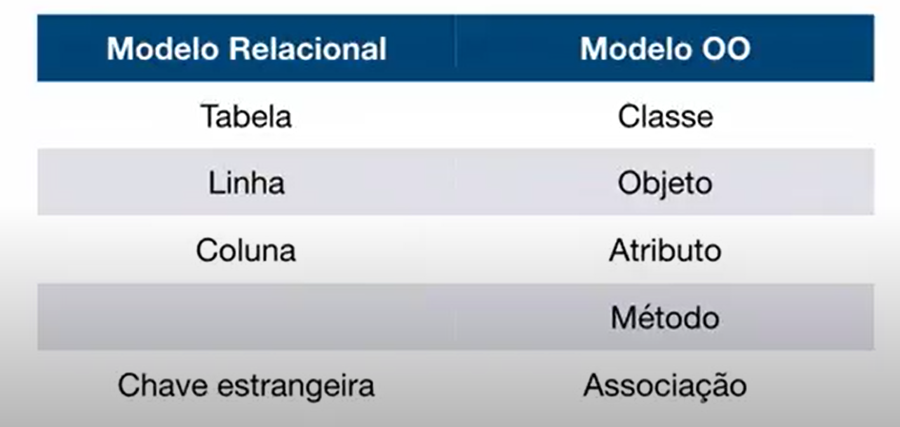

# MODELAGEM DE REST API

## Assuntos abordados:

- Introdução[ok]
- Spring e Injeção de dependencias
- 

# Introdução 

## Projeto a ser Desenvolvido

Sistema de Delivery de Comida, tipo Ifood/Uber Eats, Será um MVP(Produto minimo Viavel) de sistema de comidas;

## Tecnologias

- Maven
- Spring Data JPA (biblioteca que vai ajudar a criar repositorio para usa o jakarta persistence)
- POSTMAN (para testar uma restApi, as requisições)
- Mysql Server
- Flyway (ferramenta para gerenciamento de schema de banco de dados, para manutenção das colunas, tabelas relacionamentos e etc)
- Spring Boot DevTools (restarta a aplicação automaticamente)

- 

## API

- O que é uma API? 

Aplicattion Programming Interface(Interface de programação de aplicação). É um componente de 
Software que possui um conjunto de funções que faz a intermediação de acesso a funcionalidades de algum sistema.

**Para que possa existir uma API é necessário existir dois papeis.**

SOFTWARE CONSUMIDOR <-> API <-> SOFTWARE PROVEDOR.

O software consumidor conversa com o software provedor através de uma API.

## Web Services x APIS(é muito amplo) ,

Web Services são um tipo de API que fornece a sua interface de comunicação pela web.Quando flamos em WebServices estamos
falando de webApi. Uma API não necessariamente precisa servir ao publico externo apenas, mas também ao publico interno.

Todos webservices são APIS, mas nem toda API é webService.

Existem diversas APIS expostas no mundo, dificilmente uma aplicação moderna não consome uma API. 

## Exemplos de API:

Exemplo de uma API do Ifood

SOFTWARE RESTAURANTE <-> API DO IFOOD <-> IFOOD

GRAÇAS A API OS RESTAURANTES PODEM AUTOMATIZAR OS SEUS PEDIDOS

Outro Exemplo - Consumindo webServoices de um provedor:

O agendador de POSts seria um software utilitário para consumir uma API nesse caso o Linkedin

Consumindo Web Services de vários provedores:

Posso ter uma aplicação, onde o cliente chega a uma agencia de viagem, onde o meu software consulta as Apis para verificar quais pacotes são
mais baratos. Uma única aplicação consulta várias APIS e verifica a melhor opção. Lembrando que as Apis utilizada por sua aplicação pode estar consultando
outras APIS.

APIS consumidas por suas User Interfaces e outros sistemas

API consultando outras APIS, um exemplo um aplicativo mobile que consulta a sua própria API, a sua API consulta a melhor opção para o cliente,
podemos ter sites, sistemas internos consumindo a sua API. E podmos também expor a minha API para empresas externas, através de comissão e oytros.

## Exemplos reais de WEB APIS ( Podemos fazer várias integrações com essas APIS)

- Spotify: [https://developer.spotify.com/documentation/web-api/reference/#/operations/get-new-releases]
- Ifood : https://developer.ifood.com.br/pt-BR/
- portal transparecnia do governo: https://portaldatransparencia.gov.br/api-de-dados/cadastrar-email
- Mercado livre: https://developers.mercadolivre.com.br/pt_br/desenvolvimento-seguro (desenvolver um software para ajudar os vendedores/ ou fazer uma integração com ERP para facilitar para os usuarios dessas empresas)
- enotas : https://docs.enotasgw.com.br/docs  (enotas facilita pois expôe sua API e através do enotas pois podemos emitir notas fiscais para diversas prefeituras - paga)
- outras milhares de APIS pagas ou gratuitas 

# Spring e Injeção de Dependências

## O que é Spring REST?

Spring Rest não existe, é apenas um termo para se dizer que temos uma REST API desenvolvida com Spring.

## O que é Spring?

Um ecossistema de projeto, ajuda a desenvolver aplicações com simplicidade e flexibilidade.
O foco do Spring é foco na regra do negócio.Reduzir complexidade do Negócio. Possui maturidade e modularidade.
O Spring está em evolução constante. Spring é openSource e tem uma comunidade forte além de ser muito popular.

Quando falamos em Spring Framework, estamos falando de um projeto que serve como base para todos os outros.

Features
-Spring MVC: usado para Web
-Core tecnologies: base do spring pois está a injeção de dependencia para o Objeto funcionar;
- e muitos outros

Spring Data é um projeto guarda-chuva que agrupa vários outros projetos relacionados a acesso a dados.

- Utilizaremos o Spring Data JPA: ele ajuda a implementar repositórios JPA de forma simples(conhecido como jakarta Persistence),
  Jpa é uma especificação de persistencia de dados para java, ou seja uma tecnologia usada para trabalhar com acesso e com as operações
  relacionadas ao banco de dados relacional usando Java.

Codigo boilerPlate: codigo que precisa escrever várias vezes sendo repetitivos;

Spring Boot: é um projeto que ajuda a criar projetos que se alto configuram, seguindo convenções, não é necessário se preocupar com
a maioria das configurações, eles podem configurar não só os projetos do seu ecossitema, mas também de bibliotecas terceiras.
Spring Boot não gera código, não substitui Spring MVC,Data e outros , ele apenas complementa os outros projetos;

O spring boot incorpora um servlet container, por padrão é o tomcat dentro do jar da aplicação. Dentro do jar ele já tem um container com o tomcat embutido,
ou seja ele já sobe a aplicação

O spring boot apenas ajuda a criar o projeto, não gera código, quando criamos um projeto inicial no springInitializer ela cria uma classe main.

Pensando um pouco no maven que um gerenciador de dependencias, para reduzir a quantidade de linhas de código, utilizamos os startes, que são dependencias 
que agrupam outras dependencias. um exemplo se quisermos trabalhar com jpa podemos incluir o start nas dependencias do POM. 

## Spring boot ou Spring MVC

Spring boot não é um framework só para desenvolvimento WEB, mas você pode usar Spring boot para aplicações que rodam fora da web. 
Spring boot é uma camada de abstração em cima do spring, é uma camada que simplifica ainda mais o desenvolvimento das nossas aplicações, inclusive
spring MVC.

## Spring MVC

Spring MVC é um projeto do ecossistema Spring para desenvolver controladores web que recebem requisições HTTP, e develvem uma 
resposta, podem ser ResrApi ou devolver html ou qualquer outro tipo de arquivo.

O Spring MVC foi adicionado no projeto através do start "web" que incluimos na geração do projeto nas dependencias do maven.

## Spring vs Jakarta EE(Java EE)

Jakarta EE administrado pelo o Eclipse Foundation. A plataforma java EE foi batizada de Jakarta EE. Java EE é baseada em especificações. Um exemplo o JPA é uma especificação que está dentro do jakarta EE,
o JEE é uma especificção guarda chuva que tem várias sub especificações, JPA está dentro do JEE, JPA foi a padronização de algo que já existia, o Hibernate. 
Hibernate após a padronização passou a implemetar a especificação, então o hibernate passou a se tornar o produto a implementação da especificação JPA.

Muitos confundem a diferença entre o Hibernate e o JPA. O Hibernate é de fato o framework ORM, ou seja, a implementação física do que você usará para persistir, remover, atualizar ou buscar dados no SGBD. Por outro lado, o JPA é uma camada que descreve uma interface comum para frameworks ORM.

Hoje o hibernate tem outros concorrentes, se hoje falarmos que estamos usando o JPA não necessariamente estamos o hibernate. 

O Hibernate é um framework para o mapeamento objeto-relacional escrito na linguagem Java, mas também é disponível em .Net com o nome NHibernate.

Com JPA, se houver a necessidade de alterar o sistema de banco de dados, basta trocar o dialeto que um novo e compatível SQL é gerado em tempo de execução. Interessante notar também que o uso do JPA permite que a implementação da especificação seja alterada sem impactos no fonte da aplicação.

## O que é o Java EE?

O Java EE (Java Enterprise Edition) consiste de uma série de especificações bem detalhadas, dando uma receita de como deve ser implementado um software que faz 
cada um desses serviços de infraestrutura.

## O que é Maven

Maven é uma ferramenta de gerenciamento de dependencias e automação de build de projetos java.
Não necessariamente precisa ser com spring.

A estrutura de pastas é padronizada pelo o Maven.

Na raiz do projeto temos os arquivo pom.xml. É onde ficam as configurações de maven no projeto.

pom-> object project model

o arquivo HELP.md é apenas um arquivo que podemos incluir alguma observação do projeto, mas não influencia em nada.

mvnw.cmd e mvnw -> maven wrapper, ele possilita que executemos um maven no terminal, mesmo que não tenha um maven instalado você
não precisa instalar no Sistema operacional. Ou seja ele baixa automaticamente da internet.

Várias IDES já possuem um maven embutido dentro dele.

O maven ajuda a fazer o build do projeto, mas como fazer esse build?
Eu posso clicar em cima do projeto -> Run as -> Maven build, que eu rodo o build do maven. Vai aparecer as configurações.

O package significa que eu quero empacotar, no console roda o maven  e ele gera o pacote, gera o jar dentro da pasta target
dentro do projeto, dentro dele existem várias pastas , o mais importante é o jar.

No terminal eu posso fazer dessa forma também usando o comando:

**escrevi o comando mvn clean package, posso ** ele limpa e gera o jar do nosso projeto. Ou seja ele gera o Build.

Esse arquivo jar é o nosso projeto empacotado, eu posso encaminhar ele por email para que alguém pudesse utilizar o projeto.

**mvn clean - limpa os arquivos anteriores do build

## Class Loader

Class loader ela é responsável por ler a estrutura das classes do nosso projeto e ficar na memória
Ele cria duas class loader, um chamado de base e outro de restart. Tudo que não muda, por exemplo as bibliotecas
ele adiciona no class loader de base, e o que desenvolvemos ele inclui no class loader restart.
Toda vez que alteramos o que desenvolvemos ele reinicia o class loader de restart, e isso torna muito mais rápido o 
desenvolvimento.

## O que é injeção de Dependencias

Injeção de dependência é um padrão de desenvolvimento de programas de computadores utilizado quando é necessário 
manter baixo o nível de acoplamento entre diferentes módulos de um sistema.

Injeção de Dependência é um é um padrão de projeto usado para evitar o alto nível de acoplamento de código.

## Spring IOC Container 

É a implementação de  injeção de dependências do Framework. É algo bem comum em Frameworks que implementam inversão de 
controler/inversão no spring nós temos o Spring Context, ele é reponsável pela injeção de dependencias, como instanciar, de configurar 
injetar Objetos em outros objetos.

No Spring quando rodamos uma aplicação o IOC Container, ele é inicializado e começa a instancializar os Beans que ele deve gerenciar.
Bean(Dependence/dependencia) é nome dado a objetos gerenciados pelo o container do Spring. O Bean é instanciado, ele é configurado e 
pode ser injetado em outros Beans que são gerenciados pelo o Container do spring.

O Container de inversão de Controler do Spring é representado pela interface Aplication Context.

## O que são pontos de Injeção

Pontos de injeção é onde podemos fazer a injeção de objetos dentro dos nossos Beans.

## Anotações

- @Controller : quando eu anoto uma classe com essa inscrição, eu estou dizendo que ela é reponsável por receber requisições web.

## maneira de atualizar a aplicação quando ocorre alteração

Incluir no maven o starter : spring-boot-devtools

## Para fazer desambiguação de Bean

- Usar a anotação @Primary além de componente

- Outra forma de desambiguação : @Qualifier("nome") e também incluir na classe que recebe a injeção
qualifier é um identificador que qualifica o nosso componente.
Formas de descrever o identificador do qualifier: normal, urgente, prioritário mas isso não é padrão é apenas uma maneira.
Um problema quando utilizamos o identificador qualifier é qu ela usa uma string, e uma String não é checada em tempo de
compilação , e sim de execução. Além do que se houver mudança teremos que alterar em todos os locais, pois não será feito 
a alteração automatica, e só saberemos após compilar se está correto

ex:
@Qualifier("urgente")
private  Notificador notificadores;

- Desambiguação de beans com anotação cutomizada , criamos uma anotação customizada.

e utilizamos as anotações:
@Qualifier
@Retention(RetentionPolicy.RUNTIME)//diz quanto tempo deve permanecer onde foi usada, o runtime diz que ela pode ser 
lida em tempo de execução

## Spring Profiles

O Spring Profiles ajuda a segregar as configurações do seu aplicativo e torná-los disponíveis apenas em determinados
ambientes . Um aplicativo executado em muitos ambientes diferentes. Por exemplo, Dev, QA, Test, Stage, Production etc.

é uma forma de separar as aplicações em ambientes diferentes.

O Spring Profiles ajuda a definir facilmente as configurações corretas nos ambientes corretos . Caso contrário, sem ter 
Spring Profiles, é um grande problema gerenciar configurações específicas do ambiente. Por exemplo, sua aplicação pode 
ter que depender das configurações externalizadas nos ambientes. Obviamente, isso é bastante difícil de manter em 
sincronia. Caso contrário, você terá que escrever um monte de componentes semelhantes a fábricas para disponibilizar 
certas coisas com base em determinados parâmetros de parâmetros específicos do ambiente.

Esse profile requer um nome, esse componente notificador vai ser registrado apenas se estiver rodando no ambiente "prod"

@Profile("prod")

Eu tenho que incluir no application.properties ->spring.profiles.active=prod

Eu posso ter vários profiles no application.properties, tenho apenas que separar por vigula e definir os componentes de configuração
com as anotações @Profiles
Ex:spring.profiles.active=prod, mysql, s3, filesystem
Eu posso combinar , e ajuda a deixar a plicação flexível e eseparar ambientes.

## Bean

O @Bean serve para exportar uma classe para o Spring, para que ele consiga carregar essa classe e fazer injeção de
dependência dela em outra classes.

Todos os Beans no spring possuem um ciclo de vida, ou seja as fazes desde existencia desse bean(quando foi injetado) até
quando ele deixa de existir no container

As 3 fazes do ciclo de vida são:

- A fase inicialização;
- Onde vai usar o bean;
- A fase de destruição do Bean;

Podemos implementar métodos de callback para o ciclo de vida, ou seja metodos que declaramos e são chamados pelo o 
próprio container quando passa por alguma fase do ciclo de vida;

@PostConstruct
public void init(){
System.out.println("INIT" + notificadores);
}
//destroy será chamado um pouco antes do bean destuir
@PreDestroy
public void destroy(){
System.out.println("DESTROY");
}

    public void ativar(Cliente cliente) {

        cliente.ativar();
        System.out.printf("Seu cadastro %s  no sistema está ativo \n", cliente.getNome());

    }
}

-> Lembrando que usamos as anotações:     @PostConstruct ,    @PreDestroy, as mesmas não são do Spring e sim do  javax.annotation.

Resultado no console

2022-05-30 10:58:59.833  INFO 8844 --- [  restartedMain] w.s.c.ServletWebServerApplicationContext : Root WebApplicationContext: initialization completed in 955 ms
NotificadorEmail: Real
INITcom.aeviles.deliveryapi.noficacao.NotificadorSms@46f6e363
2022-05-30 10:59:00.129  INFO 8844 --- [  restartedMain] o.s.b.d.a.OptionalLiveReloadServer       : LiveReload server is running on port 35729
2022-05-30 10:59:00.162  INFO 8844 --- [  restartedMain] o.s.b.w.embedded.tomcat.TomcatWebServer  : Tomcat started on port(s): 8080 (http) with context path ''
2022-05-30 10:59:00.170  INFO 8844 --- [  restartedMain] c.a.deliveryapi.DeliveryApiApplication   : Started DeliveryApiApplication in 1.643 seconds (JVM running for 1.989)
/****************Ativando Clientes**************/
Seu cadastro Joao Pedro  no sistema está ativo
Seu cadastro Maria Silva  no sistema está ativo
DESTROY

Outra forma, seria criar uma classe de configuração:

@Configuration
public class ServiceConfig {

    @Bean(initMethod = "init", destroyMethod = "destroy")
    public  AtivacaoClienteService ativacaoClienteService(){
        return new AtivacaoClienteService();
    }
}

onde na anotação @Bean você inclui o init e o destroy

## Mock

Na programação orientada a objeto, objetos mock ou fictícios são objetos simulados que imitam o comportamento de 
objetos reais. Os objetos Mocks são geralmente usados em testes de unidade.

## Observer

um padrão de projeto bastante importante e muito utilizado, o padrão Observer. O padrão Observer é utilizado quando 
se precisa manter os objetos atualizados quando algo importante ocorre.

O Observer é um padrão de projeto de software que define uma dependência um-para-muitos entre objetos de modo que 
quando um objeto muda o estado, todos seus dependentes são notificados e atualizados automaticamente.

O Java também fornece suporte para o padrão de projeto Observer. As API’s mais gerais são a interface Observer e a 
classe Observable no pacote java.util. Elas são bastante semelhantes ao que foi dito aqui, porém possuem bem mais 
recursos que podem ajudar a vida do desenvolvedor em algumas circunstâncias.

Em geral a classe Observable é como o nosso Subject discutido anteriormente, porém Observable é uma classe e não uma 
interface. Alguns dos métodos do Observable são addObserver(), deleteObserver(), notifyObservers(), setChanged(). 
A classe Observable nada mais faz do que monitorar todos os observadores e os notificar sobre alguma alteração no estado.

Um detalhe importante é que antes de Subject chamar o método update() do seus assinates (Observers) deve-se chamar o 
método setChanged() que seta o estado interno do objeto para true, ou seja, chamando o método diz-se que o estado foi
alterado e os Observadores devem ser notificados. Quando este método de Subject é chamado aciona-se o método 
notifyObservers() chamando o método update() de cada Observador passando o objeto e os dados alterados. 
Após as notificações o setChanged() é novamente setado como falso e só chamará o método notifyObservers()
novamente quando for acionado.

De uma forma geral o padrão Observer deixa o acoplamaneto mais baixo entre nossas classes. E o Spring implementa esse 
padrão o qual é chamado de inverter hendler. 

O Spring fornece a classe private ApplicationEventPublisher que permite que publiquemos eventos.

Foi criado um classe que só escuta ->ApplicationEventPublisher. 

@Component
public class AtivacaoClienteService {

    @Autowired
    private ApplicationEventPublisher eventPublisher;

    public void ativar(Cliente cliente) {
        cliente.ativar();

        eventPublisher.publishEvent(new ClienteAtivadoEvent(cliente));
    }
}

## Configurações 

Uma boa prática de programação é não incluir configurações hardCoded dentro do código, um exemplo se irá incluir uma porta, 
um ip de um  banco de dados, um servidor de e-mail, nunca escrever no código java.

E projetos Spring boots, podemos configurar em arquivos de propriedade java os properties files, arquivos yam/yml, em variáveis
de ambiente do SO, também por parâmetros de linha de comando.

No SpringBoot por padrão vem o arquivo application.properties. Nesse arquivo podemos fazer diversas configurações, as que já 
vem do springboot e também podemos criar

Listagem das propriedade que o Spring boot fornece:

- https://docs.spring.io/spring-boot/docs/current/reference/html/application-properties.html

podemos por exemplo mudar a porta a padrão é 8080: server.port=8081 aí teriamos que acessar :http://localhost:8081/hello

## Criando e acessando propriedade customizadas com @Value

e eu crio as variaveis. E associo com através de uma expression do spring${}

## Acessando propriedade com @ConfigurationProperties

Ao invés de incluir configurações com proriedades customizadas, podemos criar uma classe que representa as configurações
de um determinado grupo. E ao invés de injetar valor por valor podemos injetar um objeto dessa classe.

## Persistencia de Dados (capitulo3)

- O que é persistencia de dados?
é um termo usado para dizer que queremos preservar os dados por um tempo, para além da utilização do software.
Ex: quando cadastramos um cliente em um sistema, nós queremos que esses dados sejam persistidos em algum local
de forma que sempre que quizermos consultar uma lista de cliente , esse dado esteja preservado. Nós usamos banco de dados
para fazer a persistencia. No nosso exemplo vamos utilizar o MySql

Nós temos o código java -> temos um driver JDBC -> temos o  BD mySQL

- Driver JDBC: Driver JDBC é um componente de software que intermedia  o acesso de uma aplicação java com o BD, nesse caso
o MySql. Cada Banco de dados tem pelo o menos uma implementação de JDBC. O código java conversa apenas com o JDBC, e 
ele faz a comunicação com o Banco de dados.

Exemplo de uma persistencia sem o uso de JPA:

Exemplo de consulta sem JPA:

- O que é ORM? Object-Relational Mapping , Mapeamento Objeto Relacional é uma técnica para mapeamento de classes que representam
entidades para tabelas de um Banco de Dados relacional. O ORM simplifica a persistencia de dados, de forma a facilitar para 
o programador trabalhe mais com POO e menos no modelo Relacional.

**Mapeamento Objeto-Relacional**

Do lado esquerdo nós temos uma representação Relacional no lado direito temos a representação do modelo Orientado a Objetos

- Persistencia com ORM:

o driver JDBC não fala mais diretamente com o código java, mas sim o o ORM.

Persistencia com ORM - Mapeamento objeto realcional, orm esta usando as mestas informações

Eu faço persistencia através de um objeto. Nesse caso pessoa, e em relacional o Objeto Pessoa é o nome da tabela

Se eu quiser consultar uma pessoa:

- SQL trabalha diretamente contra tabelas de banco de dados relacional, registros e campos, considerando que JPQL 
trabalha com Java classes e instâncias. Por exemplo, a JPQL consulta pode recuperar uma entidade objeto em vez de 
campo resultado definido a partir de um banco de dados, como com o SQL.

## O que é Java Persistence API(JPA)?

Java Persistence API é uma API padrão da linguagem Java que descreve uma interface comum para frameworks de persistência
de dados. A JPA define um meio de mapeamento objeto-relacional para objetos Java simples e comuns, denominados beans de
entidade. JPA é uma especificação JEE, uma solução ORM para persistencia de dados, que é padronizada para desenvolvimento
de aplicações java. JPA define a forma de mapeamento Objeto Relacional possui uma API de consultas e modificaçõess de dados,
e a linguagem de consulta JPQL, na classe java nós utilizamos anotações

- O que é Hibernate? 
Hibernate é uma implementação da especificação JPA, ou seja é o produto que vc coloca no seu produto e usa ele.
- Ou seja JPA descreve como vai funcionar a implementação e Hibernate implementa a solução de acordo coma descrição/implementação.

A JPA, é uma especificação Java para acessar, persistir e gerenciar dados entre objetos Java e um banco de dados 
relacional. O JPA foi definido como parte da especificação EJB 3.0 como um substituto para a especificação EJB 2 CMP 
Entity Beans. A JPA veio da necessidade de simplificar a complexidade do EJB para persistir dados.

A JPA agora é considerada a abordagem padrão da indústria para ORM – Object to Relational Mapping.
Mas independente do framework ORM utilizado, seja o Hibernate, o EclipseLink, o TopLink, o OpenJPA, etc, isso não 
importa, a aplicação será portável para qualquer banco de dados que possua driver JDBC. E não será preciso reescrever 
o código-fonte, pois ele será o mesmo para todos os bancos de dados.

Como funciona a JPA – Ele funciona através de qualquer framework ORM (Mapeamento Objeto Relacional) baseado na especificação JPA.
Pode ser o framework Hibernate, EclipseLink, TopLink, OpenJpa, etc.

Nesse diagrama podemos ver o mundo exterior ao sistema onde os usuários podem acessar a aplicação de qualquer dispositivo,
seja um computador, um tablet, um smartphone ou um notebook, eles vão através da aplicação chamar a camada ORM, onde e
localiza a interface JPA e o framework utilizado seja o Hibernate, o EclipseLink, o TopLink, o OpenJPA, etc. 
E nesse diagrama podemos ver detalhadamente a divisão entre a interface JPA e o framework ORM utilizado.

Agora vou citar alguns objetos da API JPA:

EntityManagerFactory – Interface usada para interagir com a fábrica do gerenciador de entidades para a unidade de persistência.
Quando o aplicativo terminar de usar a fábrica do gerenciador de entidades e/ou no encerramento do aplicativo, o aplicativo 
deve fechar a fábrica do gerenciador de entidades. Depois que um EntityManagerFactory é fechado, todos os seus gerenciadores 
de entidade são considerados no estado fechado.

EntityManager – Interface usada para interagir com o contexto de persistência.
Uma instância de EntityManager está associada a um contexto de persistência. Um contexto de persistência é um conjunto de 
instâncias de entidade em que, para qualquer identidade de entidade persistente, existe uma instância de entidade única. 
Dentro do contexto de persistência, as instâncias de entidade e seu ciclo de vida são gerenciados. A API EntityManager é 
usada para criar e remover instâncias de entidade persistentes, para localizar entidades por sua chave primária e para consultar entidades.
O conjunto de entidades que podem ser gerenciadas por uma determinada instância EntityManager é definido por uma unidade 
de persistência. Uma unidade de persistência define o conjunto de todas as classes relacionadas ou agrupadas pelo aplicativo 
e que devem ser colocadas em seu mapeamento em um único banco de dados.

Agora vou citar algumas anotações da API JPA:
@Entity – Serve para a API JPA saber que a classe anotada com @Entity corresponde a uma tabela da base de dados. 
Uma entidade corresponde a uma tabela.
@Table – É usada em conjunto com a anotação @Entity, serve para a API JPA saber o nome da tabela, em que a classe anotada 
com @Table, tem um atributo “name”, que contém o nome da tabela.

Abaixo segue um exemplo prático da utilização das anotações @Entity e @Table.

Abaixo a ilustração da classe Blog, como podem ver ela possui as anotações @Entity e @Table. E na anotação @Table,
o atributo name, está preenchido com o nome da tabela “blog”.

Abaixo a ilustração da classe Categoria, como podem ver ela possui as anotações @Entity e @Table. E na anotação @Table, 
o atributo “name”, está preenchido com o nome da tabela “categoria”.

## Como fica a Persistencia com banco de dados com JPA

O nosso código java utiliza a API do JPA, ele usa métodos , interfaces e tudo mais, quem implementa essas interfaces é o hibernate
eeé o hibernate que conversa com Driver JDBC.

## Diferença entre JPA E JDBC

JPA é mais rapido no desenvolvimento, e menos trabalhoso. Já que no JDBC você usa SQL nativo para trabalhar diretamente com 
os registros, enquanto que no JPA você trabalha com objetos criados a partir desses registros, concluímos que a performance da 
primeira tecnologia é maior que a da segunda.

## Observações BD

- AI- AUTO INCREMENT: É quando eu quero deixar a responsabilidade para o próprio Banco de Dados incrementar o ID, sem ele 
teremos que incluir manualmente.

Configurando na Entity com a anotação @GeneratedValue(strategy = GeneratedType.IDENTITY), ou seja estratégia de geração de valor
GeneratedType.IDENTITY -> quer dizer que eu estou passando a responsabilidade de gerar o valor de identificador, para o
provedor de persistencia, ou seja o banco de dados. E quando startarmos novamente ele já inclui o autoincremente

Para criar a massa de teste geralmente , criamos um arquivo  padrão chamado 'import.sql'  o qual possui alguns dados para
fazermos nossos testes.

- Existe uma interface em JPA chamada EntityManager , ela é responsável por gerenciar o contexto de persistencia, ele traduz os comandos,
intermedia os comandos pelos SQLS; Com EntityManager conseguimos excluir, consultar, salavar no BD.
-Todas as operações de busca ou de alteração vão nascer com a instância da classe EntityManager.

@PersistenceContext - > aqui ele faz a injeção do EntityManager
private EntityManager manager;

Existe um ciclo de vida das entidades JPA, que é mostrado no diagramaacima. 

Estados de uma entidade:

Uma entidade pode assumir alguns estados com relação ao EntityManager. Os estados podem ser:

- Novo (new ou transient) ->O estado “novo” é o mais natural. É simplesmente quando construímos um objeto qualquer usando o operador new.
- Gerenciado (managed) ->Para estar no estado “gerenciado”, ou seja uma instancia gerenciada pelo o JPA, quando ela está nesse
estado de persistencia ela reflete no BD, podemos chamar os métodos persist, merge ou buscar a entidade usando o EntityManager.
- Removido (removed) ->O estado “removido” é alcançado quando chamamos o método remove.
- Desanexado (detached) ->Por último, uma entidade fica no estado “desanexado” quando é passada para o método detach.
é um estado não gerenciado pelo oJPA.

Para podermos remover uma instancia de cozinha, precisamos transformar o estado de Transient para o managed, senão não será possivel
realizar a remoção.

- Importante notar que entidades desanexadas podem voltar a ser gerenciadas com a chamada do método merge.

Exemplo de uma consulta:

public List<Cozinha> listar(){

TypedQuery<Cozinha> cozinhaTypedQuery=manager.createQuery("from cozinha", Cozinha.class);

    return cozinhaTypedQuery.getResultList();

    }

Para obter o resultado digitado em JPQL, podemos usar o seguinte método deEntityManager

* essa String um JPQL -> linguagem de consulta do JPA, ele consulta em Objetos e não em tabelas
* poderiamos colocar "select from cozinha" ele traria so o nome
* Cozinha.class-> eu quero uma lista de Cozinha

## DDD (Domain-Driven Design (DDD)

Domain-Driven Design (DDD) é um conjunto de princípios para projeto de software, organizados e sistematizados em 2003,
por Eric Evans, em um livro com o mesmo nome.

Os princípios defendidos por DDD têm, no seu conjunto, um objetivo central: permitir o desenvolvimento de sistemas cujo
design é centrado em conceitos próximos e alinhados com um domínio de negócio.

O domínio de um sistema consiste da área e problema de negócio que ele pretende resolver.

## Padrão Agregate do DDD

* Padrão Agregate: é um grupo de objetos de domínio que pode ser tratado como uma unidade

Exemplo: 

- o pacote(agregado) que agrupo Pedido , itemPedido e StatusPedido, sempre que for mexer
num itemPedido temos que mexer no Pedido, existe uma consistencia entre eles.
Podemos dizer que itemPedido é menos forte que Pedido, por isso Pedido é o AgregateRoot.
Um agregado terá apenas um agregateRoot, qualquer referencia de fora do agregado, deve direcionar apenas para o agregateRoot,
devemos evitar ter um relacionamento fora do agregateRoot

O item Pedido está referenciando Produto, NÃO PODERIA referencias FotoProduto.

Usamos esses padrões para deixar a nossa aplicação mais consistente. 

O AgregateRoot garante a integridade de todo o Agregado.

## Padrão Repository do DDD

O Repository é um padrão que adiciona uma camada  de abstração para acesso a dados. Ele imita uma Collection, de forma que 
quem usa o repository, qual mecanismo de persistencia está sendo utilizado pelo o repository
 
Essa interface não tem nenhum detalhe de mecanismo de persistencia. Chamamos esse repositorio de Repositorio Orientado a
persistencia.

## Código BoilerPlate

Em programação de computadores, código boilerplate se refere a seções de código que devem ser incluídas 
em muitos lugares com pouca ou nenhuma alteração.

Para podermos esconder usamos o lombok. Para que o código fique mais limpo.

## Mapeamento relacionamento com @ManyToOne(muitos para um)

Mapeamento relacionamento com @ManyToOne :Neste relacionamento, cada linha de uma entidade é referenciada a muitos 
registros filho em outra entidade. O importante é que os registros de filhos não podem ter vários pais.

    //anotação de muitos para um(muitos restaurantes possuem uma cozinha)
    @ManyToOne
    private Cozinha cozinha;

CREATE TABLE `restaurante` (
`id` bigint NOT NULL AUTO_INCREMENT,
`nome` varchar(255) DEFAULT NULL,
`taxa_frete` decimal(19,2) DEFAULT NULL,
`cozinha_id` bigint DEFAULT NULL,
PRIMARY KEY (`id`),
KEY `FK76grk4roudh659skcgbnanthi` (`cozinha_id`),
CONSTRAINT `FK76grk4roudh659skcgbnanthi` FOREIGN KEY (`cozinha_id`) REFERENCES `cozinha` (`id`)
) ENGINE=InnoDB DEFAULT CHARSET=utf8mb4 COLLATE=utf8mb4_0900_ai_ci

CREATE TABLE `restaurante` (
`id` bigint NOT NULL AUTO_INCREMENT,
`nome` varchar(255) DEFAULT NULL,
`taxa_frete` decimal(19,2) DEFAULT NULL,
`cozinha_id` bigint DEFAULT NULL,
PRIMARY KEY (`id`),
KEY `FK76grk4roudh659skcgbnanthi` (`cozinha_id`),
CONSTRAINT `FK76grk4roudh659skcgbnanthi` FOREIGN KEY (`cozinha_id`) REFERENCES `cozinha` (`id`)
) ENGINE=InnoDB AUTO_INCREMENT=4 DEFAULT CHARSET=utf8mb4 COLLATE=utf8mb4_0900_ai_ci

O motor InnoDB é o mais utilizado como padrão de engenharia da tabela 

- isso só precisa ser feito se criar as entidades(tabelas) através das entidades , senão esta gerando as tabelas atarves
das entidades não é necessário incluir essas anotações de nullable 

Se você estiver trabalhando com banco de dados legado ou queira alterar o nome da coluna é necessário incluir a anotação
@JoinColumn(name="cozinha_id")

    @ManyToOne
    @JoinColumn(name = "cozinha_id") //pra alterar o nome da coluna
    private Cozinha cozinha;

Para especificar que não aceita nulo é necessário incluir dentro da anotação @Colunn(nullable=false)

    @Column(name = "taxa_frete", nullable = false)
    private BigDecimal taxaFrete;

## O que é REST

REST:acrônimo REpresentational State Transfer, é um estilo arquitetural para desenvolver WEB API'S, ou seja para desenvolver
WEB SERVICES,
REST é uma especificação que define a forma de comunicação entre componentes de software na web, independente da linguagem 
de programação usada.

REST surgiu nos anos 2000, a partir da tese de PHD de um cientista chamado Roy Fielding, seu intuito era formalizar um 
conjunto de melhores práticas
para desenvolvimento de webServices, essas melhores práticas são chamadas de constraints(regras) que devem ser seguidas 
para uma API ficar em conformidade com
REST, então uma RESTAPI é uma API que segue as regras especificadas por Roy Thomas Fielding.

Rest é um estilo arquitetural utiliado para desenvolver REST APIS/ WEB Services, ele foi desenvolvido para usar protocolos 
que já existem, como o HTTP.

Essa comunicação é feita utilizando a aespecificação REST

Para que uma aplicação possa consumir uma REST API ela precisa conhecer apenas o protocolo HTTP não precisa instalar nada.
E essa facilidade de integração
entre os sistemas, fez com que REST se torna-se a forma mais popular para desenvolver webServices. As APIS mostradas acima 
utilizam a arquitetura REST.

## Por que usar REST?

- Separação entre cliente(quem consome a api) e servidor(quem provê a API), dessa forma nós temos uma maior flexibilidade 
e portabilidade.
- Escalabilidade, se um servidor não está sendo sufiente , podemos incluir outros;
- Independência de linguagem;
- As APIS podem interagir entre si, além de serem consumidas ´por outras aplicações;
- demanda alta de mercado
- REST ajuda muito a fazer integrações

## Constraints (melhores práticas)

- Cliente-servidor:( nós precisamos de um cliente que pode ser uma aplicação front-end, mobille, uma outra API enviando 
requisições para um servidor, as aplicações cliente servidor podem evoluir sem inteferir no outro, inclusive um 
cliente x servidor pode ser substituído sem interferir em nada, desde que a interface entre eles seja inalterada.

- Stateless: significa sem estado, a aplicação não deve ter estado, Roy Fielding se inspirou no protocolo http para essa 
constraint, na prática quer dizer que essa requisição feita ao servidor da API , deve conter tudo para que seja devidamente
processada. O servidor não pode manter uma seção.

- Cache: , a API pode fazer cache das requisições, cache é uma memória de consulta rápida, ela melhora a escalabilidade 
do servidor, pois reduzimos o numeros de hits no servidor, ou seja numero de acesso. (possibilidade de incluir quando necessário)

- Interface Uniforme (desacopla a arquitetura) para ficar de acordo com essa constraint devemos identificar os recursos 
do sistema usando URI's seguindo um padrão. Devemos usar o padrão do protocolo de comunicação para interagir com a API, 
geralmente usamos o verbo do protocolo http( put, get, delete, post...). A resposta de uma requisição deve ser padronizada,
incluindo informações de como o cliente deve tratá-la;

- Sistema em camadas, a possibilidade entre o cliente que consome e o servidor que hospeda a API ter outros servidores no meio do caminho,
  esses servidores podem oferecer uma camada de segurança, de cache, balanceamento de carga, o cliente não deve conhecer quantas camadas possuem no meio

- Código sobe demanda(opcional) o servidor pode enviar como resposta de um código que deve ser utilizado no cliente. (Pouco usada)

## REST X RESTFUL

A diferença entre os termos são conceituais, REST é o estilo arquitetural que possui as constraints ou seja é a especificação,
RESTful API é uma API desenvolvida em conformidade com as constraints, ou seja uma REST API segue todas as contraints obrigatórias.

## PROTOCOLO HTTP

O modelo arquitetural REST independe de linguagem e tecnologia, REST não restringe o uso de um protocolo em particular, apesar do modelo ser independente
de protocolo, para colocar REST m prática é necessário o uso de um, e o mais usado é o protocolo http.

COMO FUNCIONA O PROTOCOLO HTTP

CLIENTE <=> |REQUISIÇÃO X RESPOSTA |<=> SERVIDOR

COMPOSIÇÃO DA REQUISIÇÃO

Para formar uma requisição precisamos de um método/URI/versão do protocolo http/cabeçalhos e corpo.
As vezes chamamos os métodos de verbos http

Método -> indica a ação que queremos que seja executado; (GET, POST, PUT, DELETE)

- get: o metodo get solicita que seja devolvido nas repostas os dados que precisamos
- post: o metodo post submete dados para o servidor, usamos muito para adicionar dados no BANCO DE DADOS

URI-> caminho que identifica o que queremos dentro do servidor http. POST /produtos em palavras cadastrando produtos
**Composição de Requisição**

Apesar de existir a versão 2.0 do http a mais comum ainda é a 1.1 .

Os cabeçalhos são informações sobre a requisição. Eles definem nomes de chaves e valores, que podem ser usados pelo o servidor
para interpretar a requisição e executar a operação. Temos vários cabeçalhos pré-definidos no protocolo HTTP, mas podemos 
criar os nossos próprios cabeçalhos customizados também. 
No cabeçalho acima nós temos o Content-Type, que define qual tipo de conteúdo está sendo enviada no corpo da requisição.
Estamos dizendo que a requisição está indo com um corpo no formato json(um formato de transporte de dados), o cabeçalho content-Type 
é muito importante para o servidor saber  como interpretar a mensagem no corpo corretamente.
Temos o Accept: que define quais tipos de conteúdo são aceitos como uma resposta, nesse exemplo estamos especificando um, que
é o json, isso quer dizer que o servidor obrigatoriamente deve retornar uma resposta nesse formato especificado.
Se o servidor não puder devolver uma resposta neste formato é melhor que ele retorne um erro.

Em relação ao corpo de uma requisição ele não é obrigatório, depende do método http utilizado.
Basicamente é no corpo da requisição que enviamos os dados do cliente para o servidor.

Nesse exemplo estamos enviando um produto.

**Composição da resposta**

Uma versão também possui componentes importantes, como a versão do protocolo http, status, cabeçalho e corpo.

O status serve para descrever o status do processamento da requisição.
O servidor deve retornar um status adequado para cada situação. Para que possamos saber o que aconteceu.
Exemplo: se o servidor realizou com sucesso, se houve algum erro, etc...
O Status 201 - é retornado na resposta, esse status significa que o recurso foi criado com sucesso.
Ou seja o recurso foi cadastrado com sucesso

Nesse exemplo a resposta informa que o conteúdo está no formato json. 

E o corpo da resposta é onde fica o conteúdo da resposta. Pode ter um corpo ou não.

Corpo/Payload, não é obrigatório, e é nesse corpo que enviamos oa dados para API

composição da resposta

HTTP /[VERSAO][STATUS]
[Cabeçalhos]

[CORPO]

-----------------------------
HTTP/1.1 201 Created
Location: /produtos/331
content-Type: application/json
{
"cosdigo":331,
"nome": "Notebook",
"preco": 2100.00
}

status serve para descrever o resultado da requisição (201 created- um recurso foi criado com sucesso)
corpo da resposta: é onde fica o conteudo da resposta

## RECURSOS REST

Um recurso é qualquer coisa exposta na web, é algo que tem importancia para ser refenciado no software. Exemplo: documento, pagina, video, foto,
até mesmo um processo de negócio, em um ecommerce um produto pode ser considerado um recurso.

Singleton Resource.Um recurso é uma instancia de uma determinada classe. Um recurso que significa uma unica coisa é chamado de singleton Resource.
Os recusos podem ser agrupados em coleções(collection Resource)Coleção de Produtos é um recurso.

## IDENTIFICANDO RECURSOS

REST utiliza URI para identificar os Recursos, URI é uniforme Resource Identifier, identificador de recurso uniforme, nada mais é que um conjunto
de caracteres  que tem como objetivo dar um endereço para os recursos de forma não ambigua.

Quando modelamos um recurso temos que pensar em um tipo de URI para identifica-los.

URI X URL: URL é um tipo de URI.

Ex: /listasProdutos

url Completa: httpd://api.algamarket.com.br/listasProdutos

Não é uma boa pratica identificar uma URI dessa forma

o corretos é : /produtos
sem identificar ação

RECURSO UNICO
/produto/{codigo}

url Completa: httpd://api.algamarket.com.br/produtos/331

temos que usar o recurso sempre no plural, pois facilita o consumidor da API e quem desenvovle

## Flyway

O Flyway é um framework que permite o versionamento e gerenciamento do Banco de dados, com ele podemos controlar a
evolução dos elementos que compõem uma determinada base de dados, sendo eles Tabelas, Sequences, Views, entre outros.

Podemos utilizar o Flyway para manipular diferentes sistemas de Banco de dados relacionais, isso é possível porque ele é
desenvolvido baseado na API JDBC onde basta especificar o Driver do banco e realizar as migrações.

O Flyway pode ser utilizado através de linha de comando, ou utilizando ferramentas como Maven, Gradle, Ant, SBT,
entre outras.

Criando os Scripts

Os scripts são criados utilizando a linguagem SQL ou através de uma API Java, neste exemplo utilizaremos SQL, o Flyway
segue uma convenção para o nome dos Scripts, que é V{numero da versão}__<nome_do_script>.sql, estes scripts devem ser
adicionados dentro do diretório sql(são dois underscore após o numero da versão).

## Metodos http /Verbos http

Métodos http também conhecido como verbos http. Através dos métodos http nós dizemos para o servidor qual
tipo de serviço nós devemos executar em um determinado recurso indentificado pela URI.

Método GET : é usado quando existe a necessidade de obter a representação  de um recurso. O GET não gera efeito
colateral, não tem alteração no estado sa aplicação. O GET não é usado para mudar um recurso, por isso ele 
é chamado idempotente.

Idempotente: significa que requisições repetidas na sequencia não geram efeito colateral;

## Códigos de Status

 Mais conhecidos:

- 200 - ok (Esse tipo de código indica que a solicitação foi bem-sucedida. A carga útil enviada em uma reação 200 depende da técnica de solicitação. Para os sistemas)
- 201 - created(A solicitação foi atendida e trouxe pelo menos um novo recurso sendo feito. O recurso essencial feito pelo pedido é reconhecido)
- 204 - no content (O servidor satisfez efetivamente a solicitação e que não há conteúdo extra para enviar no corpo da carga de reação. Metadados na reação)
- 400 - Bad Reques
- 401 - Unauthorized
- 404 - Not Found
- 500 - Internal Server Error(um erro que o servidor não consegue tratar)

## Representações para recursos

Hoje utilizamos com mais frequencia o json, mais pode ser alterado pelo o consumidor da APIatravés do cabeçalho accept na
requisição.

Headers (cabeçalhos http): é nesse campo que espedivifamos os cabeçalhos customizados;

- Accept (cabeçalho padrão, que nós consumidores da Api aceitamos como respostas): application/json(application media type)

- Negociação de Conteúdo(Content Negotiation) posso escolher o formato que preciso

Json Padrão

Alterando para XML

Para alterar o tipo de arquivo para outro formato além do json, é necessário configurar o servidor;

Para trabalhar com o formato xml inclui no gerenciador de dependencias o jackson

<!-- jackson é uma biblioteca utilizada para serializar e desiarilizar os objetos, ou seja fazer a transformar um tipo 
de objeto java para xml ou outros. -->
		<dependency>
			<groupId>com.fasterxml.jackson.dataformat</groupId>
			<artifactId>jackson-dataformat-xml</artifactId>

		</dependency>
		
		
		
## TODO

- Investigar ->https://javabydeveloper.com/org-hibernate-hql-internal-ast-querysyntaxexception-entity-table-is-not-mapped/
O erro ocorreu devido eu ter incluido o nome da entidade(entity) diferente da tabela, foi uma letra, mas fez a diferença não gerando [ok]
		
- Leitura: https://engsoftmoderna.info/artigos/ddd.html
- Leitura: https://engsoftmoderna.info/
- Leitura: https://martinfowler.com/bliki/DDD_Aggregate.html
		
	
## Referencias

- (Códigos http)[https://www.iana.org/assignments/http-status-codes/http-status-codes.xhtml#http-status-codes-1]

- https://httpstatus.com/
- https://dev.mysql.com/doc/connector-j/8.0/en/connector-j-reference-jdbc-url-format.html

- https://www.tutorialspoint.com/pg/jpa/jpa_jpql.htm
- 

